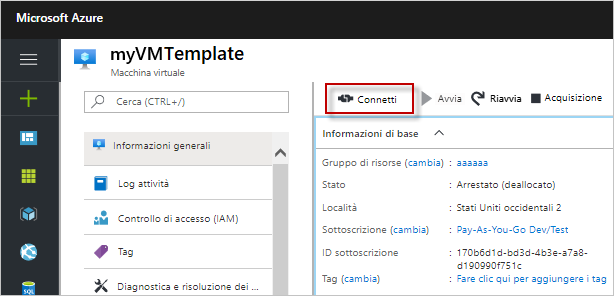
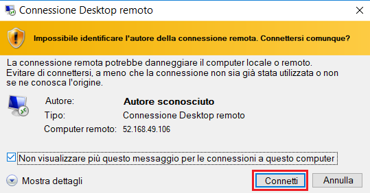
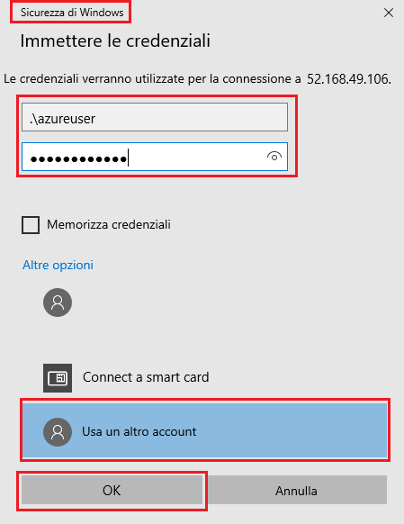
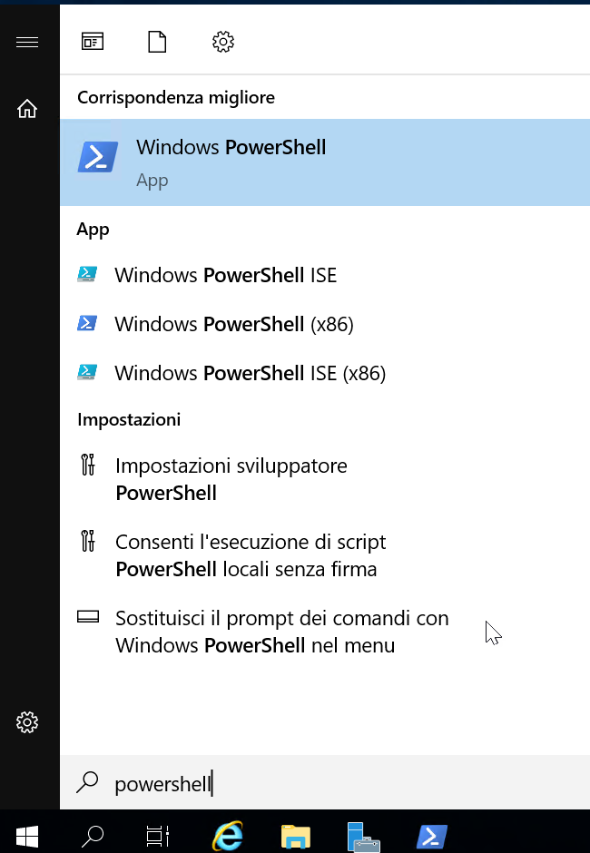
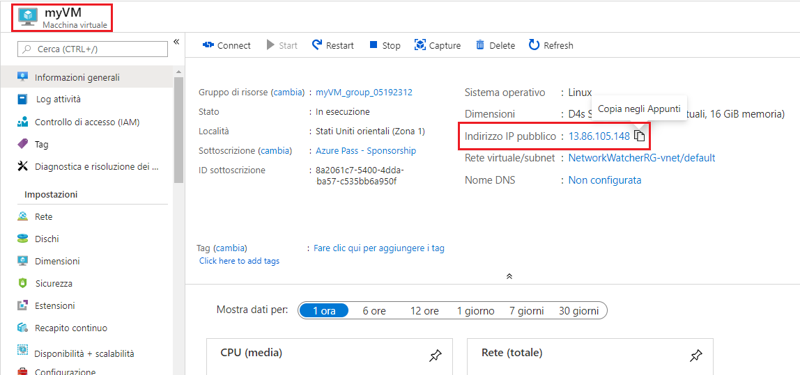
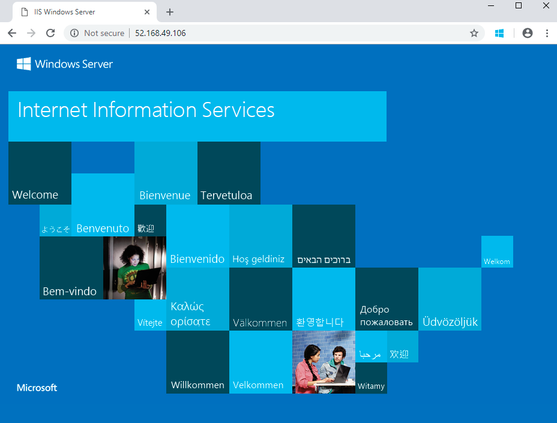

---
wts:
    title: '01 - Creare una macchina virtuale nel portale (10 min)'
    module: 'Modulo 02 - Descrizione dei servizi principali di Azure (carichi di lavoro)'
---
# 01 - Creare una macchina virtuale nel portale

In questa procedura dettagliata verrà creata una macchina virtuale in Azure a cui ci si connetterà, quindi verrà installato e testato il ruolo del server Web. 

**Nota**: durante questa procedura dettagliata, riservarsi del tempo per leggere il contenuto delle icone di informazioni. 

# Attività 1. Creare la macchina virtuale (10 min)

In questa attività verrà creata una macchina virtuale Windows Server 2019 Datacenter - Gen1. 

1. Accedere al portale di Azure [(https://portal.azure.com)](https://portal.azure.com?azure-portal=true).

2. Nel pannello **Tutti i servizi** cercare e selezionare **Macchine virtuali**, quindi fare clic su **+ Aggiungi** e scegliere **+ Macchina virtuale**.

3. Nella scheda **Informazioni di base** inserire le informazioni seguenti (lasciare i valori predefiniti per tutto il resto):

    | Impostazioni | Valori |
    |  -- | -- |
    | Sottoscrizione | **Scegliere la propria sottoscrizione**|
    | Gruppo di risorse | **myRGVM** (Crea nuovo) |
    | Nome della macchina virtuale | **myVm** |
    | Località | **(Stati Uniti) Stati Uniti orientali**|
    | Immagine | **Windows Server 2019 Datacenter - Gen1**|
    | Dimensioni | Standard D2s v3|
    | Nome utente account amministratore | **azureuser** |
    | Password account amministratore | **Pa$$w0rd1234**|
    | Regole porte in ingresso - Consenti porte selezionate | **RDP (3389)** e **HTTP (80)**|
    | | |

4. Passare alla scheda Rete e cercare l'opzione **Selezionare le porte in ingresso**:

    | Impostazioni | Valori |
    | -- | -- |
    | Selezionare le porte in ingresso | **HTTP (80), RDP (3389)**|
    | | |

    **Nota** - Verificare che siano selezionate entrambe le porte 80 e 3389

5. Passare alla scheda Gestione e quindi, nella sezione **Monitoraggio**, selezionare l'impostazione seguente:

    | Impostazioni | Valori |
    | -- | -- |
    | Diagnostica di avvio | **Disabilita**|
    | | |

6. Lasciare i valori predefiniti per le rimanenti impostazioni, quindi fare clic sul pulsante **Rivedi e crea** alla fine della pagina.

7. Una volta superata la convalida, fare clic sul pulsante **Crea**. La distribuzione della macchina virtuale può richiedere da cinque a sette minuti.

8. Per ricevere aggiornamenti, vedere la pagina della distribuzione e l'area **Notifiche** (l'icona della campanella nel menu superiore).

* **Verificare che le porte 80 e 3389 siano state aperte**

# Attività 2. Connettersi alla macchina virtuale

In questa attività verrà stabilita la connessione alla nuova macchina virtuale tramite RDP. 

1. Cercare **myVM** e selezionare la nuova macchina virtuale.

    **Nota**: è anche possibile usare il collegamento **Vai alla risorsa** nella pagina della distribuzione oppure il collegamento alla risorsa nell'area **Notifiche**.

2. Nel pannello **Panoramica** della macchina virtuale fare clic sul pulsante **Connetti** e scegliere **RDP**.

    

    **Nota**: le istruzioni seguenti indicano come connettersi alla VM da un computer Windows. In un Mac è necessario scaricare dall'App Store un client RDP, ad esempio questo client desktop remoto, mentre in un computer Linux è possibile usare un client RDP open source.

2. Nella pagina **Connetti alla macchina virtuale** mantenere le opzioni predefinite per connettersi con l'indirizzo IP pubblico sulla porta 3389, quindi fare clic su **Scarica file RDP**.

3. Scegliere **Apri** per aprire il file RDP scaricato, quindi fare clic su **Connetti** quando richiesto. 

    

4. Nella finestra **Sicurezza di Windows** selezionare **Altre opzioni** e quindi **Usa un altro account**. Specificare il nome utente (.\azureuser) e la password (Pa$$w0rd1234). Fare clic su **OK** per connettersi.

    

5. Durante il processo di accesso, è possibile che venga visualizzato un avviso relativo al certificato. Fare clic su **Sì** per creare la connessione e connettersi alla VM distribuita. La connessione dovrebbe essere stabilita correttamente.

    

Congratulazioni! È stata distribuita e connessa una macchina virtuale Windows Server in Azure

# Attività 3. Installare e testare il ruolo del server Web

In questa attività si installa il ruolo del server Web in un server e si verifica che venga visualizzata la pagina iniziale di IIS.

1. Aprire un prompt dei comandi di PowerShell nella macchina virtuale: fare clic sul pulsante **Start**, digitare **PowerShell**, fare clic con il pulsante destro del mouse su **Windows PowerShell**, quindi scegliere **Esegui come amministratore** nel menu di scelta rapida.

    

2. Installare la funzionalità **Web-Server** nella macchina virtuale eseguendo il comando seguente nel prompt dei comandi di PowerShell. È possibile copiare e incollare il comando.

    ```PowerShell
    Install-WindowsFeature -name Web-Server -IncludeManagementTools
    ```
  
3. Al termine, verrà visualizzato il prompt **Operazione riuscita** con il valore **True**. Non è necessario riavviare la macchina virtuale per completare l'installazione. Chiudere la connessione RDP alla VM.

    

4. Di nuovo nel portale, tornare nel riquadro **Panoramica** di myVM e usare il pulsante **Copia negli Appunti** per copiare l'indirizzo IP pubblico di myVM, aprire una nuova scheda del browser, incollare l'indirizzo IP pubblico nella casella di testo URL e premere **INVIO** per passare a tale indirizzo.

    

5. Verrà visualizzata la pagina iniziale predefinita del server Web IIS.

    

Congratulazioni! È stato creato un server Web accessibile tramite il relativo indirizzo IP pubblico. Nella macchina virtuale distribuita si potrebbero distribuire e ospitare i file di un'applicazione Web per l'accesso pubblico.


**Nota**: per evitare costi aggiuntivi, è possibile rimuovere questo gruppo di risorse. Cercare e selezionare il gruppo di risorse, quindi fare clic su **Elimina gruppo di risorse**. Verificare il nome del gruppo di risorse, quindi fare clic su **Elimina**. Monitorare la pagina **Notifiche** per verificare se l'eliminazione è stata completata correttamente. 
