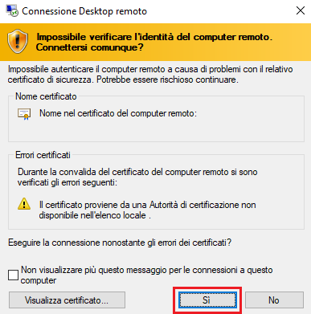

---
wts:
    title: '01 - Creare una macchina virtuale nel portale (10 min)'
    module: 'Modulo 02 - Descrizione dei servizi principali di Azure (carichi di lavoro)'
---
# 01. Creare una macchina virtuale nel portale (10 min)

In questa procedura dettagliata verrà creata una macchina virtuale in Azure a cui ci si connetterà, quindi verrà installato e testato il ruolo del server Web. 

**Nota**: durante questa procedura dettagliata, riservarsi del tempo per leggere il contenuto delle icone di informazioni. 

# Attività 1. Creare una macchina virtuale 
1. Accedere al portale di Azure: **(https://portal.azure.com)**.

3. Dal pannello **Tutti i servizi** nel menu del portale, cercare e selezionare **Macchine virtuali**, quindi fare clic su **+Aggiungi, +Crea, +Nuovo** e dall'elenco a discesa selezionare **+Macchina virtuale**.

4. Nella scheda **Informazioni di base** inserire le informazioni seguenti (lasciare i valori predefiniti per tutto il resto):

    | Impostazioni | Valori |
    |  -- | -- |
    | Sottoscrizione | **Usare l'impostazione predefinita fornita** |
    | Gruppo di risorse | **Crea nuovo gruppo di risorse** |
    | Nome della macchina virtuale | **myVM** |
    | Area | **(Stati Uniti) Stati Uniti orientali**|
    | Immagine | **Windows Server 2019 Datacenter - Gen1**|
    | Dimensioni | **Standard D2s v3**|
    | Nome utente account amministratore | **azureuser** |
    | Password account amministratore | **Pa$$w0rd1234**|
    | Regole per le porte in ingresso - | **Consenti selezione porte**|
    | Selezionare le porte in ingresso | **RDP (3389)** e **HTTP (80)**| 

5. Passare alla scheda Rete per verificare che le porte **HTTP (80) e RDP (3389)** siano selezionate nella sezione **Seleziona porte in ingresso**.

6. Passare alla scheda Gestione, quindi, nella sezione **Monitoraggio**, selezionare l'impostazione seguente:

    | Impostazioni | Valori |
    | -- | -- |
    | Diagnostica di avvio | **Disabilita**|

7. Lasciare i valori predefiniti per le rimanenti impostazioni, quindi fare clic sul pulsante **Rivedi e crea** in fondo alla pagina.

8. Una volta superata la convalida, fare clic sul pulsante **Crea**. La distribuzione della macchina virtuale può richiedere da cinque a sette minuti.

9. Per ricevere aggiornamenti, vedere la pagina della distribuzione e l'area **Notifiche** (l'icona della campanella nella barra dei menu in alto).

# Attività 2. Connettersi alla macchina virtuale

In questa attività verrà stabilita la connessione alla nuova macchina virtuale tramite RDP (Remote Desktop Protocol, Protocollo desktop remoto). 

1. Cercare **myVM** e selezionare la nuova macchina virtuale.

    **Nota**: è anche possibile usare il collegamento **Vai alla risorsa** nella pagina della distribuzione oppure il collegamento alla risorsa nell'area **Notifiche**.

2. Nel pannello **Panoramica** della macchina virtuale, fare clic sul pulsante **Connetti** e dall'elenco a discesa selezionare **RDP**.

    

    **Nota**: le istruzioni seguenti indicano come connettersi alla VM da un computer Windows. In un Mac è necessario scaricare dall'App Store un client RDP, ad esempio questo client desktop remoto, mentre in un computer Linux è possibile usare un client RDP open source.

2. Nella pagina **Connetti alla macchina virtuale** mantenere le opzioni predefinite per connettersi con l'indirizzo IP pubblico sulla porta 3389, quindi fare clic su **Scarica file RDP**. Il file scaricato viene visualizzato in basso a sinistra sulla schermata.

3. Fare clic su **Apri** per aprire il file RDP scaricato (visualizzato in basso a sinistra sul computer lab), quindi fare clic su **Connetti** quando richiesto. 

    

4. Nella finestra **Sicurezza di Windows**, accedere con le credenziali di amministratore usate per creare la VM, il nome utente **azureuser** e la password **Pa$$w0rd1234**. 

5. Durante la procedura di accesso, è possibile che venga visualizzato un avviso relativo al certificato. Fare clic su **Sì** per creare la connessione e connettersi alla VM distribuita. La connessione dovrebbe essere stabilita correttamente.

    

Nel lab verrà avviata una nuova macchina virtuale (myVM). Chiudere le finestre di Server Manager e del dashboard che si aprono (fare clic sulla "x" in alto a destra). Si dovrebbe vedere lo sfondo blu della macchina virtuale. **Congratulazioni!** È stata distribuita ed è stata stabilita la connessione a una macchina virtuale con Windows Server in esecuzione su di essa. 

# Attività 3. Installare e testare il ruolo del server Web

In questa attività verrà installato il ruolo server Web sul server in esecuzione sulla macchina virtuale appena creata e si verificherà che venga visualizzata la pagina iniziale di IIS. 

1. Sulla macchina virtuale, avviare PowerShell cercando **PowerShell** nella barra di ricerca e, una volta trovato, fare clic con il pulsante destro del mouse su **Windows PowerShell**, quindi fare clic su **Esegui come amministratore**.

    

2. In PowerShell, installare la funzionalità **Web-Server** nella macchina virtuale eseguendo il comando seguente. (Incollare il comando e premere INVIO per avviare l'installazione.)

    ```PowerShell
    Install-WindowsFeature -name Web-Server -IncludeManagementTools
    ```
  
3. Al termine, verrà visualizzato il prompt **Operazione riuscita** con il valore **True**. Non è necessario riavviare la macchina virtuale per completare l'installazione. Chiudere la connessione RDP alla VM facendo clic sulla **x** posta nella barra blu in alto al centro della macchina virtuale. 

    

4. Di nuovo nel portale, tornare nel riquadro **Panoramica** di myVM e usare il pulsante **Copia negli Appunti** per copiare l'indirizzo IP pubblico di myVM, quindi aprire una nuova scheda del browser, incollare l'indirizzo IP pubblico nella casella di testo dell'URL e premere **Invio** per accedere a quell'indirizzo.

    

5. Verrà visualizzata la pagina iniziale predefinita del server Web IIS.

    

**Congratulazioni!** È stata creata una nuova VM su cui è in esecuzione un server Web accessibile tramite il relativo indirizzo IP pubblico. Nella macchina virtuale distribuita si potrebbero distribuire e ospitare i file di un'applicazione Web per l'accesso pubblico.


**Nota**: per evitare costi aggiuntivi, è possibile rimuovere questo gruppo di risorse. Cercare e selezionare il gruppo di risorse, quindi fare clic su **Elimina gruppo di risorse**. Verificare il nome del gruppo di risorse, quindi fare clic su **Elimina**. Monitorare la pagina **Notifiche** per verificare se l'eliminazione è stata completata correttamente. 
