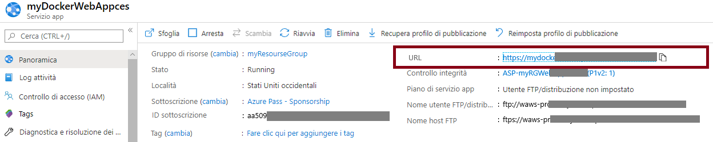
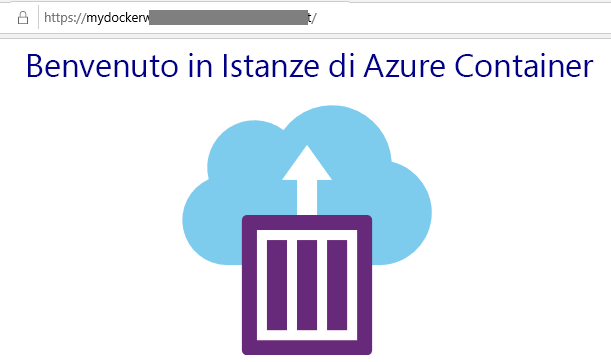

---
wts:
    title: '02 - Creare un'app Web (10 min)'
    module: 'Modulo 02 - Descrizione dei servizi principali di Azure (carichi di lavoro)'
---
# 02 - Creare un'app Web

In questa procedura dettagliata verrà creata una nuova app Web che esegue un contenitore Docker. Il contenitore visualizza un messaggio di benvenuto. 

# Attività 1. Creare un'app Web (10 min)

Servizio app di Azure è in realtà una raccolta di quattro servizi, tutti progettati per consentire l'hosting e l'esecuzione di applicazioni Web. I quattro servizi (App Web, App per dispositivi mobili, App per le API e App per la logica) sembrano diversi, ma in definitiva funzionano tutti in modo molto simile. In questo lab verrà usato il servizio App Web, che è quello usato più comunemente tra i quattro.

In questa attività verrà creata un'app Web del servizio app di Azure. 

1. Accedere al [portale di Azure](http://portal.azure.com/). 

2. Nel pannello **Tutti i servizi** cercare e selezionare **Servizi app**, quindi fare clic su **+ Aggiungi, + Crea oppure + Nuovo**

3. Nella scheda **Informazioni di base** del pannello **App Web** specificare le impostazioni seguenti (sostituire **xxxx** nel nome dell'app Web con lettere e numeri in modo che il nome sia univoco a livello globale). Lasciare i valori predefiniti per tutto il resto, incluso il piano di servizio app. 

    | Impostazione | Valore |
    | -- | -- |
    | Sottoscrizione | **Scegliere le propria sottoscrizione** |
    | Gruppo di risorse | **myRGWebApp1** (Crea nuovo) |
    | Nome | **myDockerWebAppxxxx** |
    | Pubblica | **Contenitore Docker** |
    | Sistema operativo | **Linux** |
    | Area | **Stati Uniti orientali** (ignorare eventuali avvisi sulla disponibilità del piano di servizio) |
    | | |	
    
    **Nota** - Assicurarsi di cambiare **xxxx** in modo che il valore di **Nome** sia univoco

4. Fare clic su **Avanti > Docker** e configurare le informazioni sul contenitore. Il comando di avvio è facoltativo e non è necessario in questo esercizio. 

    **Nota:** il contenitore è lo stesso di quello usato nella procedura dettagliata Istanze di Container per visualizzare il messaggio Hello World. 

    | Impostazione | Valore |
    | -- | -- |
    | Opzioni | **Contenitore singolo** |
    | Origine immagine | **Docker Hub** |
    | Tipo di accesso | **Pubblico** |
    | Immagine e tag | **microsoft/aci-helloworld** |
    | | |	

5. Fare clic su **Rivedi e crea** e quindi su **Crea**. 

# Attività 2. Testare l'app Web

In questa attività verrà testata l'app Web.

1. Attendere che l'app Web venga distribuita.

2. In **Notifiche** fare clic su **Vai alla risorsa**. 

3. Nel pannello **Panoramica** individuare la voce **URL**. 

    

4. Fare clic su **URL** per aprire una nuova scheda del browser con la pagina Benvenuto in Istanze di Azure Container visualizzata.

    

5. Tornare nel pannello **Panoramica** dell'app Web e notare che include diversi grafici. Se si ripete alcune volte il passaggio 4 sarà possibile visualizzare nei grafici i dati di telemetria corrispondenti, tra cui il numero di richieste e il tempo medio di risposta. 

**Nota**: per evitare costi aggiuntivi, è possibile rimuovere questo gruppo di risorse. Cercare e selezionare il gruppo di risorse, quindi fare clic su **Elimina gruppo di risorse**. Verificare il nome del gruppo di risorse, quindi fare clic su **Elimina**. Monitorare la pagina **Notifiche** per verificare l'avanzamento dell'eliminazione.

