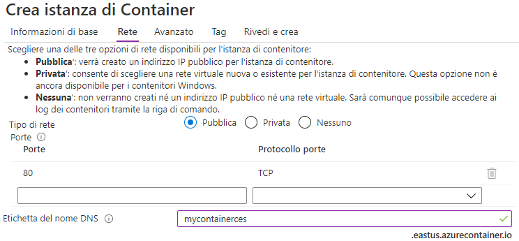
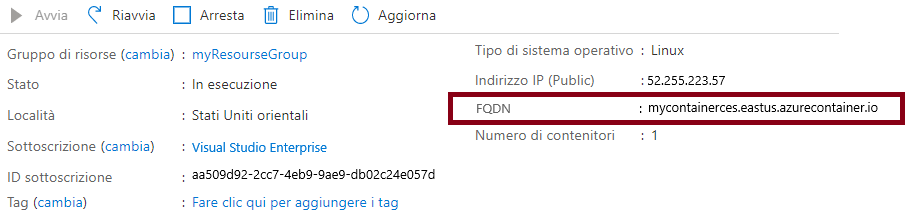
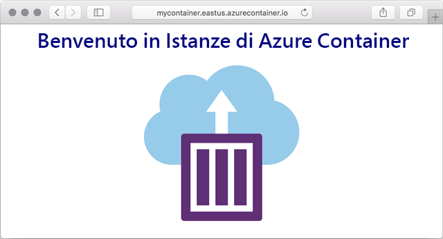

---
wts:
    title: '03. Distribuire Istanze di Azure Container (10 min)'
    module: 'Modulo 02. Descrizione dei servizi principali di Azure (carichi di lavoro)'
---

# 03. Distribuire Istanze di Azure Container

In questa procedura dettagliata verrà illustrato come creare, configurare e distribuire un contenitore Docker tramite Istanze di Azure Container nel portale di Azure. Il contenitore è un'applicazione Web Benvenuto in Istanze di Azure Container che visualizza una pagina HTML statica. 

# Attività 1. Creare un'istanza di contenitore (10 min)

In questa attività verrà creata una nuova istanza di contenitore per l'applicazione Web. 

1. Accedere al [portale di Azure](https://portal.azure.com).

2. Nel pannello **Tutti i servizi** cercare e selezionare **Istanze di Container**, quindi fare clic su **+ Aggiungi, + Crea oppure + Nuovo**. 

3. Specificare le informazioni di base seguenti per la nuova istanza di contenitore (lasciare i valori predefiniti per tutto il resto): 

	| Impostazione| Valore|
	|----|----|
	| Sottoscrizione | **Scegliere le propria sottoscrizione** |
	| Gruppo di risorse | **myRGContainer** (Crea nuovo) |
	| Nome contenitore| **mycontainer**|
	| Area | **(Stati Uniti) Stati Uniti orientali** |
	| Origine immagine| **Docker Hub o altro registro**|
	| Tipo di immagine| **Pubblico**|
	| Immagine| **microsoft/aci-helloworld**|
	| Tipo di sistema operativo| **Linux** |
	| Dimensioni| ***Lasciare il valore predefinito***|
	|||

4. Configurare la scheda Rete (sostituire **xxxx** con lettere e numeri in modo che il nome sia univoco a livello globale). Lasciare i valori predefiniti per tutte le altre impostazioni.

	| Impostazione| Valore|
	|--|--|
	| Etichetta del nome DNS| **mycontainerdnsxxxx** |
	|||
	
	**Nota**: il contenitore sarà raggiungibile pubblicamente all'indirizzo dns-name-label.region.azurecontainer.io. Se dopo la distribuzione si riceve il messaggio di errore **L'etichetta del nome DNS non è disponibile**, specificare un'etichetta del nome DNS diversa (non usare xxxx) e ripetere la distribuzione. 

	

5. Fare clic su **Rivedi e crea** per avviare il processo automatico di convalida.

6. Fare clic su **Crea** per creare l'istanza di contenitore. 

7. Monitorare la pagina della distribuzione e la pagina **Notifiche**. 

8. Durante l'attesa può essere interessante visualizzare l'[esempio di codice alla base di questa semplice applicazione](https://github.com/Azure-Samples/aci-helloworld). Passare alla cartella \app. 

# Attività 2. Verificare la distribuzione dell'istanza di contenitore

In questa attività ci si assicura che la pagina di benvenuto venga visualizzata per verificare che l'istanza di contenitore sia in esecuzione.

1. Al termine della distribuzione, fare clic sul collegamento **Vai alla risorsa** nel pannello della distribuzione oppure sul collegamento alla risorsa nell'area di notifica.

2. Nel pannello **Panoramica** di **mycontainer** assicurarsi che per **Stato** del contenitore sia visualizzato **In esecuzione**. 

3. Individuare il nome di dominio completo (FQDN).

	

2. Copiare il nome FQDN del contenitore nella casella di testo URL del Web browser e premere **INVIO**. Verrà visualizzata la pagina di benvenuto. 

	

**Nota**: è anche possibile usare l'indirizzo IP del contenitore nel browser. 

Congratulazioni! È stato usato il portale di Azure per distribuire correttamente un'applicazione in un contenitore di Istanze di Azure Container.

**Nota**: per evitare costi aggiuntivi, è possibile rimuovere questo gruppo di risorse. Cercare e selezionare il gruppo di risorse, quindi fare clic su **Elimina gruppo di risorse**. Verificare il nome del gruppo di risorse, quindi fare clic su **Elimina**. Monitorare la pagina **Notifiche** per verificare l'avanzamento dell'eliminazione.
