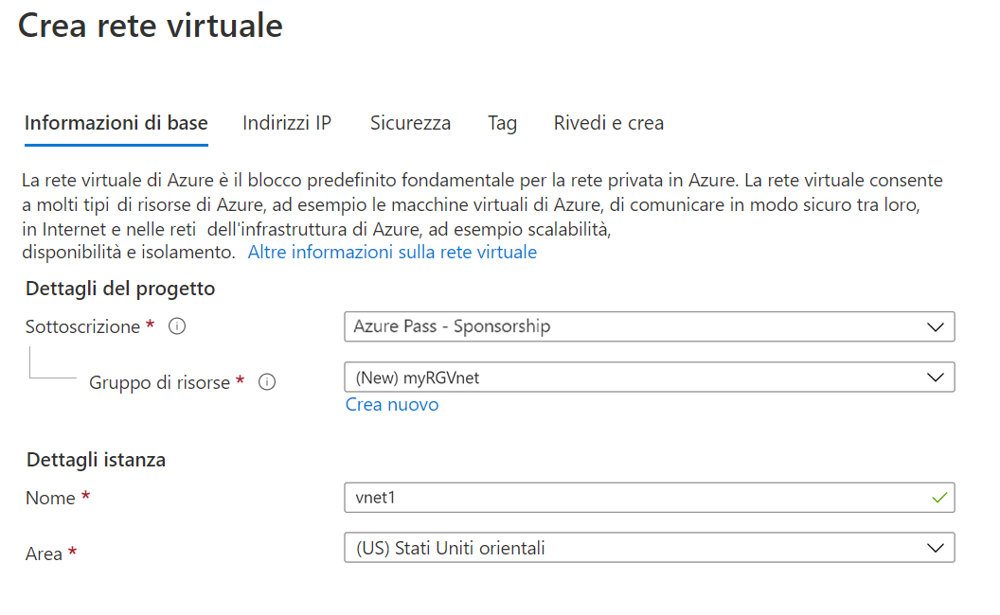
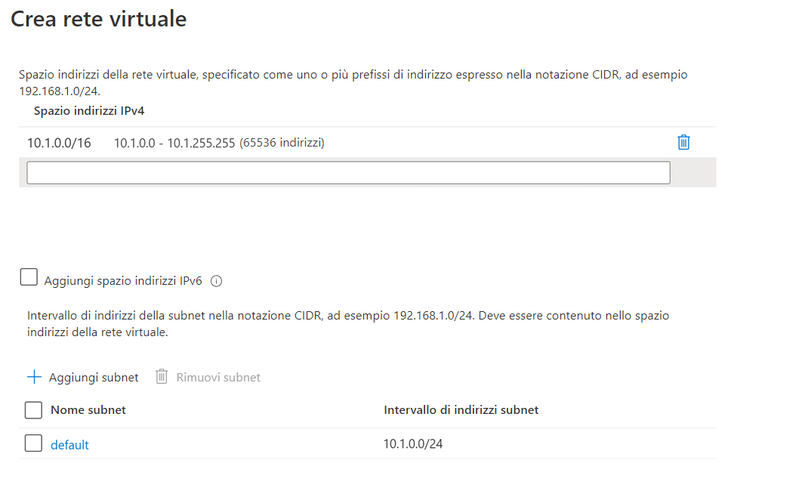

---
wts:
    title: '04. Creare una rete virtuale (20 min)'
    module: 'Modulo 02. Descrizione dei servizi principali di Azure (carichi di lavoro)'
---
# 04. Creare una rete virtuale

In questa procedura dettagliata verrà creata una rete virtuale in cui verranno distribuite due macchine virtuali, quindi si consentirà a una macchina virtuale di effettuare il ping all'altra all'interno della rete virtuale.

# Attività 1. Creare una rete virtuale (20 min)

In questa attività verrà creata una rete virtuale. 

1. Accedere al portale di Azure all'indirizzo <a href="https://portal.azure.com" target="_blank"><span style="color: #0066cc;" color="#0066cc">https://portal.azure.com</span></a>

2. Nel pannello **Tutti i servizi** cercare e selezionare **Reti virtuali**, quindi fare clic su **+ Aggiungi, + Crea oppure + Nuovo**. 

3. Nel pannello **Crea rete virtuale** inserire le informazioni seguenti (lasciare i valori predefiniti per tutto il resto):

    | Impostazione | Valore | 
    | --- | --- |
    | Sottoscrizione | **Selezionare la propria sottoscrizione** |
    | Gruppo di risorse | **myRGVNet** (Crea nuovo) |
    | Nome | **vnet1** |
    | Località | **(Stati Uniti) Stati Uniti orientali** |
    | Spazio indirizzi |**10.1.0.0/16** |
    | Subnet - Nome | **predefinito** |
    | Subnet - Intervallo di indirizzi | **10.1.0.0/24** |

    
    

5. Fare clic sul pulsante **Rivedi e crea**. Assicurarsi che la convalida venga superata.

6. Fare clic sul pulsante **Crea** per distribuire la rete virtuale. 

    **Nota**: come fare a sapere quali reti virtuali e indirizzi IP saranno necessari nell'organizzazione?

# Attività 2. Creare due macchine virtuali

In questa attività verranno create due macchine virtuali nella rete virtuale. 

1. Nel pannello **Tutti i servizi** cercare **Macchine virtuali**, quindi fare clic su **+ Aggiungi** e scegliere **+ Macchina virtuale**. 

2. Nella scheda **Informazioni di base** inserire le informazioni seguenti (lasciare i valori predefiniti per tutto il resto):

   | Impostazione | Valore | 
   | --- | --- |
   | Sottoscrizione | **Scegliere le propria sottoscrizione**  |
   | Gruppo di risorse |  **myRGVNet** |
   | Nome della macchina virtuale | **vm1**|
   | Area | **(Stati Uniti) Stati Uniti orientali** |
   | Immagine | **Windows Server 2019 Datacenter** |
   | Nome utente| **azureuser** |
   | Password| **Pa$$w0rd1234** |
   | Porte in ingresso pubbliche| Selezionare **Consenti porte selezionate**  |
   | Selezionare le porte in ingresso| **RDP (3389)** |
   |||

3. Selezionare la scheda **Rete**. Assicurarsi che la macchina virtuale venga inserita nella rete virtuale vnet1. Esaminare le impostazioni predefinite, ma non apportare altre modifiche. 

   | Impostazione | Valore | 
   | --- | --- |
   | Rete virtuale | **vnet1** |
   |||

4. Fare clic su **Rivedi e crea**. Una volta superata la convalida, fare clic su **Crea**. I tempi di distribuzione variano, ma in genere sono necessari da tre a sei minuti.

5. Monitorare la distribuzione, ma continuare con il passaggio successivo. 

6. Creare una seconda macchina virtuale ripetendo i passaggi **2- 4** precedenti. Assicurarsi di usare un nome di macchina virtuale diverso, che la macchina virtuale venga inserita nella stessa rete virtuale e che usi un nuovo indirizzo IP pubblico:

    | Impostazione | Valore |
    | --- | --- |
    | Gruppo di risorse | **myRGVNet** |
    | Nome della macchina virtuale |  **vm2** |
    | Rete virtuale | **vnet1** |
    | IP pubblico | (nuovo) **vm2-ip** |
    |||

7. Attendere che entrambe le macchine virtuali vengano distribuite. 

# Attività 3. Testare la connessione 

In questa attività si consentirà l'accesso a una VM e il ping all'altra. 

1. Nel pannello **Tutte le risorse** cercare **vm1**, aprire il relativo pannello **Panoramica** e verificare che per **Stato** sia visualizzato **In esecuzione**. Può essere necessario scegliere **Aggiorna** per aggiornare la pagina.

2. Nel pannello **Panoramica** fare clic sul pulsante **Connetti**.

    **Nota**: le istruzioni seguenti indicano come connettersi alla VM da un computer Windows. 

3. Nel pannello **Connetti alla macchina virtuale** mantenere le opzioni predefinite per connettersi tramite l'indirizzo IP sulla porta 3389, quindi fare clic su **Scarica file RDP**.

4. Aprire il file RDP scaricato e fare clic su **Connetti** quando richiesto. 

5. Nella finestra **Sicurezza di Windows** digitare il nome utente **azureuser** e la password **Pa$$w0rd1234**, quindi fare clic su **OK**.

6. Durante il processo di accesso, è possibile che venga visualizzato un avviso relativo al certificato. Fare clic su **Sì** per creare la connessione e connettersi alla VM distribuita. La connessione dovrebbe essere stabilita correttamente.

7. Aprire un prompt dei comandi di PowerShell nella macchina virtuale: fare clic sul pulsante **Start**, digitare **PowerShell**, fare clic con il pulsante destro del mouse su **Windows PowerShell**, quindi scegliere **Esegui come amministratore** nel menu di scelta rapida

8. In PowerShell digitare il comando seguente per provare a comunicare con vm2. Si noterà che l'operazione è riuscita.

   ```PowerShell
   ping vm2
   ```

Congratulazioni! Sono state configurate e distribuite due macchine virtuali in una rete virtuale. È stato inoltre verificato che è possibile comunicare tra le due VM. 

**Nota**: per evitare costi aggiuntivi, è possibile rimuovere questo gruppo di risorse. Cercare e selezionare il gruppo di risorse, quindi fare clic su **Elimina gruppo di risorse**. Verificare il nome del gruppo di risorse, quindi fare clic su **Elimina**. Monitorare la pagina **Notifiche** per verificare l'avanzamento dell'eliminazione.
