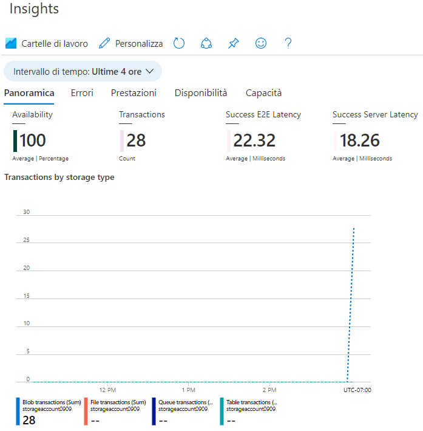

---
wts:
    title: '05 - Creare un account di archiviazione BLOB (5 min)'
    module: 'Modulo 02 - Descrizione dei servizi principali di Azure (carichi di lavoro)'
---
# 05. Creare un account di archiviazione BLOB (5 min)

In questa procedura dettagliata verrà creato un account di archiviazione e quindi si useranno i file di archiviazione BLOB.

# Attività 1. Creare un account di archiviazione 

In questa attività verrà creato un nuovo account di archiviazione. 

1. Accedere al portale di Azure all'indirizzo <a href="https://portal.azure.com" target="_blank">https://portal.azure.com</a>

2. Nel pannello **Tutti i servizi** cercare e selezionare **Account di archiviazione**, quindi fare clic su **+ Aggiungi, + Crea, + Nuovo**. 

3. Nella scheda **Informazioni di base** del pannello **Crea account di archiviazione** inserire le informazioni seguenti (sostituire **xxxx** nel nome dell'account di archiviazione con lettere e numeri in modo che il nome sia univoco a livello globale). Lasciare i valori predefiniti per tutto il resto.

    | Impostazione | Valore | 
    | --- | --- |
    | Sottoscrizione | **Lasciare il valore predefinito** |
    | Gruppo di risorse | **Crea nuovo gruppo di risorse** |
    | Nome account di archiviazione | **storageaccountxxxxx** |
    | Località | **(Stati Uniti) Stati Uniti orientali**  |
    | Prestazioni | **Standard** |
    | Ridondanza | **Archiviazione con ridondanza locale** |
    
    **Nota** - Cambiare **xxxx** in modo che il valore di **Nome account di archiviazione** sia univoco

5. Fare clic su **Rivedi e crea** per rivedere le impostazioni dell'account di archiviazione e consentire ad Azure di convalidare la configurazione. 

6. Dopo la convalida, fare clic su **Crea**. Attendere la notifica della creazione corretta dell'account. 

7. Nella home page cercare e selezionare **Account di archiviazione** e verificare che il nuovo account di archiviazione sia visualizzato.

    

# Attività 2. Usare archiviazione BLOB

In questa attività verrà creato un contenitore BLOB in cui verrà caricato un file BLOB. 

1. Fare clic sul nome del nuovo account di archiviazione, scorrere fino alla sezione **Archiviazione dei dati**, quindi fare clic su **Contenitori**.

2. Fare clic su **+ Contenitore** e completare le informazioni. Per saperne di più, usare le icone di informazioni. Al termine, fare clic su **Crea**.

    | Impostazione | Valore |
    | --- | --- |
    | Nome | **container1**  |
    | Livello di accesso pubblico| **Privato (nessun accesso anonimo)** |
  

    

4. Aprire una nuova finestra del browser e cercare l'immagine di un fiore su **Bing**. Fare clic con il pulsante destro del mouse sull'immagine e salvarla sulla macchina virtuale. 

6. Di nuovo nel Portale, fare clic su **container1**, quindi selezionare **Carica**.

5. Cercare il file di immagine appena salvato sul computer locale. Selezionarlo, quindi selezionare Carica.

   
6. Fare clic sulla freccia **Avanzate**, lasciare i valori predefiniti ma esaminare le opzioni disponibili, quindi fare clic su **Carica**.

    **Nota**: è possibile caricare un numero qualsiasi di BLOB necessari in questo modo. I nuovi BLOB verranno elencati all'interno del contenitore.

7. Una volta caricato, fare clic con il pulsante destro del mouse sul file ed esaminare le opzioni disponibili, ossia Visualizza/Modifica, Scarica, Proprietà ed Elimina. 

8. Se si ha tempo, esaminare le opzioni File, Tabelle e Code.

# Attività 3. Monitorare l'account di archiviazione

1. Tornare nel pannello Account di archiviazione e fare clic su **Diagnostica e risoluzione dei problemi**. 

2. Esplorare alcuni problemi di archiviazione più comuni. Notare che qui sono disponibili diversi strumenti di risoluzione dei problemi.

3. Nel pannello Account di archiviazione scorrere in basso fino alla sezione **Monitoraggio** e fare clic su **Informazioni dettagliate**. Come si può notare, sono presenti informazioni relative a errori, prestazioni, disponibilità e capacità. Le informazioni visualizzate variano.

    

Congratulazioni! È stato creato un account di archiviazione e quindi sono stati usati i BLOB di archiviazione.

**Nota**: per evitare costi aggiuntivi, è possibile rimuovere questo gruppo di risorse. Cercare e selezionare il gruppo di risorse, quindi fare clic su **Elimina gruppo di risorse**. Verificare il nome del gruppo di risorse, quindi fare clic su **Elimina**. Monitorare la pagina **Notifiche** per verificare l'avanzamento dell'eliminazione.
