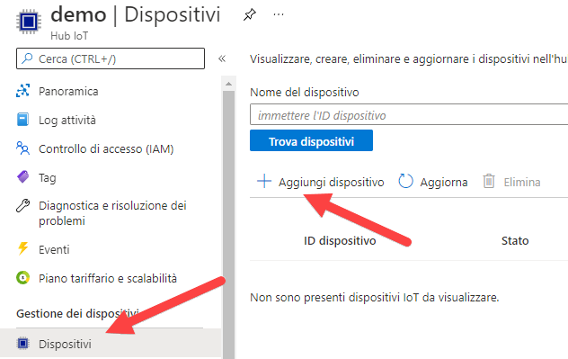

---
wts:
    title: '07 - Implementare un hub IoT di Azure (10 min)'
    module: 'Modulo 03: Descrizione delle soluzioni e degli strumenti di gestione principali'
---
# 07. Implementare un hub IoT di Azure (10 min)

In questa procedura dettagliata verrà configurato un nuovo hub IoT di Azure nel portale di Azure, quindi verrà autenticata una connessione a un dispositivo IoT tramite il simulatore di dispositivi online Raspberry Pi. I dati e i messaggi dei sensori vengono passati dal simulatore Raspberry Pi all'hub IoT di Azure ed è possibile visualizzare le metriche relative ai messaggi nel portale di Azure.

# Attività 1. Creare un hub IoT 

In questa attività verrà creato un hub IoT. 

1. Accedere al [portale di Azure](https://portal.azure.com).

2. Nel pannello **Tutti i servizi** cercare e selezionare **Hub IoT**, quindi fare clic su **+ Aggiungi, + Crea, + Nuovo**.

3. Nella scheda **Informazioni di base** del pannello **Hub IoT** inserire i dettagli seguenti nei campi (sostituire **xxxx** nel nome dell'account di archiviazione con lettere e numeri in modo che il nome sia univoco a livello globale):

    | Impostazioni | Valore |
    |--|--|
    | Sottoscrizione | **Mantenere l'impostazione predefinita** |
    | Gruppo di risorse | **Crea nuovo gruppo di risorse** |
    | Area | **Stati Uniti orientali** |
    | Nome hub IoT | **my-hub-groupxxxxx** |

    **Nota** - Cambiare **xxxx** in modo che il valore di **Nome hub IoT** sia univoco.

4. Passare alla scheda **Gestione** e usare l'elenco a discesa per impostare **Piano tariffario e livello di scalabilità** su **S1: Livello Standard**.

5. Fare clic sul pulsante **Rivedi e crea**.

6. Fare clic sul pulsante **Crea** per iniziare a creare la nuova istanza dell'hub IoT di Azure.

7. Attendere che l'istanza dell'hub IoT di Azure venga distribuita. 

# Attività 2. Aggiungere un dispositivo IoT

In questa attività verrà aggiunto un dispositivo IoT all'hub IoT. 

1. Al termine della distribuzione, fare clic su **Vai alla risorsa** nel pannello della distribuzione. In alternativa, nel pannello **Tutti i servizi** cercare e selezionare **Hub IoT** e individuare la nuova istanza dell'hub IoT

	

2. Per aggiungere un nuovo dispositivo IoT, scorrere in basso fino alla sezione **Strumenti di esplorazione** e fare clic su **Dispositivi IoT**. Quindi, fare clic su **+ Aggiungi, + Crea, + Nuovo**.

	

3. Specificare un nome per il nuovo dispositivo IoT, **myRaspberryPi**, quindi fare clic sul pulsante **Salva**. Nell'hub IoT di Azure verrà creata una nuova identità di dispositivo IoT.

4. Se il nuovo dispositivo non viene visualizzato, scegliere **Aggiorna** per aggiornare la pagina Dispositivi IoT. 

5. Selezionare **myRaspberryPi** e copiare il valore di **Stringa di connessione primaria**. Questa chiave verrà usata nell'attività successiva per autenticare una connessione con il simulatore Raspberry Pi.

	

# Attività 3. Testare il dispositivo con il simulatore Raspberry Pi

In questa attività il dispositivo verrà testato con il simulatore Raspberry Pi. 

1. Aprire una nuova scheda del Web browser e digitare il seguente collegamento: https://aka.ms/RaspPi. Si accederà a un sito del simulatore Raspberry Pi. Se si ha tempo, leggere le informazioni sul simulatore Raspberry Pi. Una volta fatto, selezionare "**X**" per chiudere la finestra popup.

2. Sul lato destro dell'area del codice, individuare la riga 'const connectionString ='. Sostituirla con la stringa di connessione copiata dal portale di Azure. Notare che la stringa di connessione include le voci DeviceId (**myRaspberryPi**) e SharedAccessKey.

	

3. Fare clic su **Run** (Esegui) sotto l'area del codice per eseguire l'applicazione. L'output della console dovrebbe visualizzare i dati e i messaggi dei sensori inviati dal simulatore Raspberry Pi all'hub IoT di Azure. I dati e i messaggi vengono inviati ogni volta che il LED del simulatore Raspberry Pi lampeggia. 

	

5. Fare clic su **Stop** (Arresta) per interrompere l'invio di dati.

6. Tornare al portale di Azure.

7. Passare al pannello **Panoramica** dell'hub IoT e scorrere in basso fino a visualizzare le informazioni di **Utilizzo dell'hub IoT**. Per vedere i dati dell'ultima ora, cambiare l'intervallo di tempo in **Mostra dati per:**.

	

Congratulazioni! È stato configurato un hub IoT di Azure per raccogliere i dati dei sensori di un dispositivo IoT.

**Nota**: per evitare costi aggiuntivi, è possibile rimuovere questo gruppo di risorse. Cercare e selezionare il gruppo di risorse, quindi fare clic su **Elimina gruppo di risorse**. Verificare il nome del gruppo di risorse, quindi fare clic su **Elimina**. Monitorare la pagina **Notifiche** per verificare l'avanzamento dell'eliminazione.
