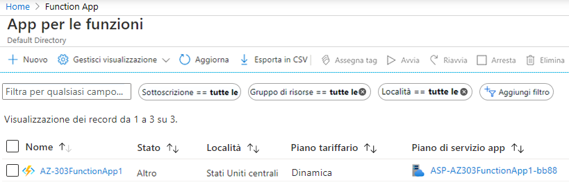
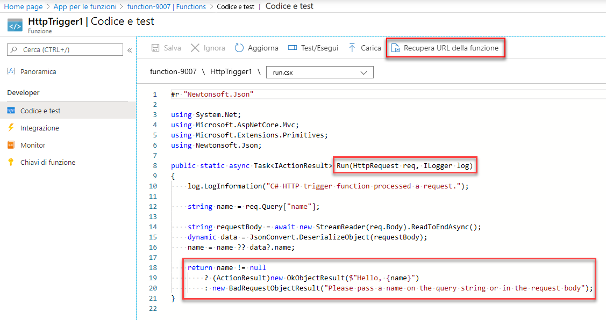
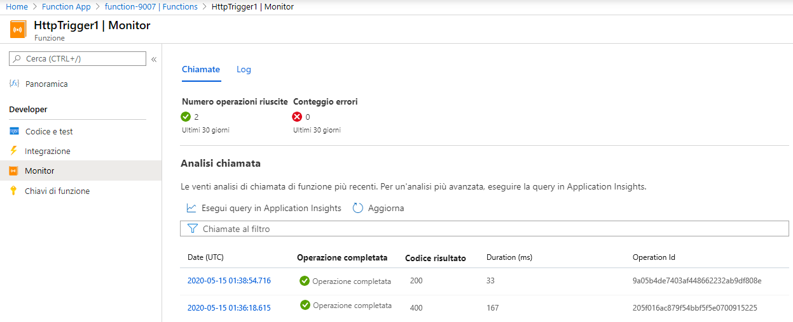

---
wts:
    title: '08. Implementare Funzioni di Azure (5 min)'
    module: 'Modulo 03. Descrizione delle soluzioni e degli strumenti di gestione principali'
---
# 08. Implementare Funzioni di Azure

In questa procedura dettagliata verrà creata un'app per le funzioni per visualizzare un messaggio di benvenuto quando viene effettuata una richiesta HTTP. 

# Attività 1. Creare un'app per le funzioni (5 min)

In questa attività verrà creata un'app per le funzioni.

1. Accedere al [portale di Azure](https://portal.azure.com).

1. Nella casella di testo **Cerca risorse, servizi e documentazione** nella parte superiore del portale cercare e selezionare **App per le funzioni**, quindi nel pannello **App per le funzioni** fare clic su **+ Aggiungi, + Crea oppure + Nuovo**.

1. Nella scheda **Informazioni di base** del pannello **App per le funzioni** specificare le impostazioni seguenti (sostituire **xxxx** nel nome della funzione con lettere e numeri in modo che tale nome sia univoco a livello globale e lasciare i valori predefiniti per tutte le altre impostazioni): 

    | Impostazioni | Valore |
    | -- | --|
    | Sottoscrizione | Il nome della propria sottoscrizione di Azure |
    | Gruppo di risorse | Il nome di un nuovo gruppo di risorse **myRGFunction** |
    | Nome dell'app per le funzioni | **function-xxxx** |
    | Pubblica | **Codice** |
    | Stack di runtime | **NET** |
    | Versione | **3.1** |
    | Area | **Stati Uniti orientali** |
    | | |

    **Nota** - Assicurarsi di cambiare **xxxx** in modo che il valore di **Nome dell'app per le funzioni** sia univoco

1. Fare clic su **Rivedi e crea** quindi, una volta superata la convalida, fare clic su **Crea** per iniziare il provisioning e la distribuzione della nuova app per le funzioni di Azure.

1. Attendere la notifica della creazione corretta della risorsa.

1. Tornare nel pannello **App per le funzioni**, fare clic su **Aggiorna** e verificare che lo stato della nuova app per le funzioni creata sia **In esecuzione**. 

    

# Attività 2. Creare una funzione attivata tramite HTTP e testarla

In questa attività verrà usata la funzione Webhook e API per visualizzare un messaggio quando viene effettuata una richiesta HTTP. 

1. Nel pannello **App per le funzioni** fare clic sulla nuova app per le funzioni creata. 

1. Nella sezione **Funzioni** del pannello App per le funzioni fare clic su **Funzioni** e quindi su **+ Aggiungi**.

    

1. Nella sezione **Seleziona un modello** del pannello **Aggiungi funzione** fare clic su **Trigger HTTP**. Nella sezione **Dettagli modello** accettare le impostazioni predefinite, quindi fare clic su **Aggiungi**.

1. Nel pannello **HttpTrigger1**, nella sezione **Sviluppatore**, fare clic su **Codice e test**. 

1. Nel pannello **HttpTrigger1\| Codice e test** esaminare il codice generato automaticamente e notare che è progettato per eseguire una richiesta HTTP e registrare informazioni. Notare inoltre che la funzione restituisce un messaggio di benvenuto con un nome. 

    

1. Fare clic su **Recupera URL della funzione** nella sezione superiore dell'editor di funzioni. 

1. Assicurarsi che il valore dell'elenco a discesa **Chiave** sia impostato su **predefinito** e fare clic su **Copia** per copiare l'URL della funzione. 

    

1. Aprire una nuova scheda del browser e incollare l'URL della funzione copiato nella barra degli indirizzi. Quando la pagina viene richiesta, la funzione verrà eseguita. Il messaggio restituito indica che la funzione richiede un nome nel corpo della richiesta.

    

1. Aggiungere **&name=*yourname*** alla fine dell'URL.

    **Nota**: sostituire ***yourname*** con il proprio nome. Se ad esempio il proprio nome è Cindy, l'URL finale sarà simile al seguente `https://azfuncxxx.azurewebsites.net/api/HttpTrigger1?code=X9xx9999xXXXXX9x9xxxXX==&name=cindy`

    

1. Quando viene eseguita la funzione, ogni richiesta viene tracciata. Per visualizzare le tracce nel portale di Azure, tornare nel pannello **HttpTrigger1\| Codice e test** e fare clic su **Monitoraggio**.

     

Congratulazioni! È stata creata un'app per le funzioni per visualizzare un messaggio di benvenuto quando viene effettuata una richiesta HTTP. 

**Nota**: per evitare costi aggiuntivi, è possibile rimuovere questo gruppo di risorse. Cercare e selezionare il gruppo di risorse, quindi fare clic su **Elimina gruppo di risorse**. Verificare il nome del gruppo di risorse, quindi fare clic su **Elimina**. Monitorare la pagina **Notifiche** per verificare l'avanzamento dell'eliminazione.
