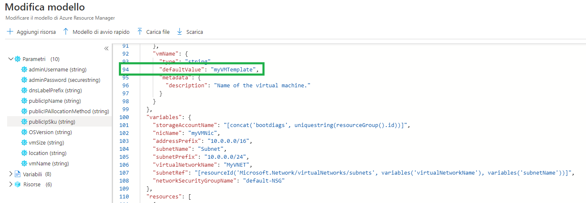
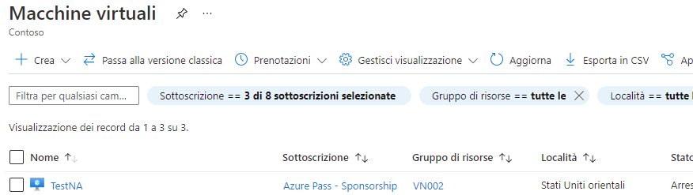
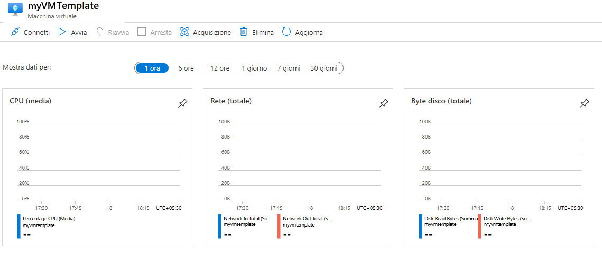
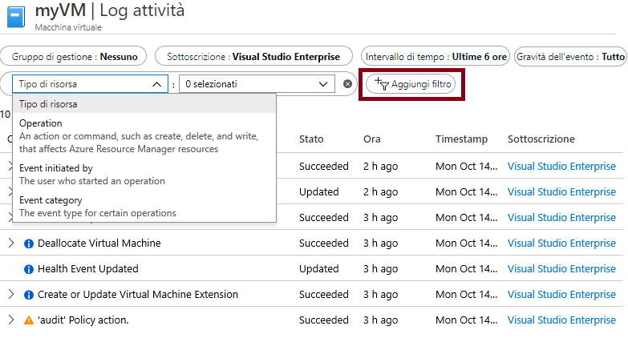

---
wts:
    title: '09 - Creare una VM con un modello (10 min)'
    module: 'Modulo 03: Descrizione delle soluzioni e degli strumenti di gestione principali'
---
# 09. Creare una VM con un modello (10 min)

In questa procedura dettagliata verrà distribuita una macchina virtuale con un modello di avvio rapido e verranno esaminate le funzionalità di monitoraggio.

# Attività 1. Esplorare la raccolta di modelli di avvio rapido e individuare un modello 

In questa attività verrà esplorata la raccolta di modelli di avvio rapido e verrà distribuito un modello per la creazione di una macchina virtuale. 

1. Nell'ambiente del lab, aprire una nuova finestra del browser e immettere T https://azure.microsoft.com/it-it/resources/templates/?azure-portal=true. La raccolta contiene numerosi modelli ampiamente diffusi e aggiornati di recente. Questi modelli automatizzano la distribuzione delle risorse di Azure, inclusa l'installazione dei pacchetti software più diffusi. Esplorare i vari tipi diversi di modelli disponibili.

3. Selezionare **Distribuisci una macchina virtuale Windows semplice**

4. Fare clic sul pulsante **Distribuisci in Azure**. La sessione del browser verrà automaticamente reindirizzata al [portale di Azure](http://portal.azure.com/).

    **Nota**: il pulsante **Distribuisci in Azure** consente di distribuire il modello tramite il portale di Azure. Durante tale distribuzione verrà chiesto di specificare solo un set ridotto di parametri di configurazione. 

5. Quando richiesto, accedere alla propria sottoscrizione Azure.

6. Nel pannello **Distribuzione personalizzata**, fare clic su **Modifica modello**. Il modello di Resource Manager è in formato JSON. Esaminare i parametri e le variabili.  Quindi individuare il parametro relativo al nome della macchina virtuale. Cambiare il nome in **myVMTemplate**. Far clic su **Salva** per salvare le modifiche. Viene nuovamente visualizzato il pannello **Distribuzione personalizzata** nel portale di Azure.

    

7. Nel pannello **Distribuzione personalizzata** configurare i parametri necessari per il modello (sostituire ***xxxx*** nel prefisso dell'etichetta DNS con lettere e numeri in modo che l'etichetta sia univoca a livello globale). Lasciare i valori predefiniti per tutto il resto. 

    | Impostazione| Valore|
    |----|----|
    | Sottoscrizione | **Mantenere le informazioni predefinie fornite**|
    | Gruppo di risorse | **Crea nuovo gruppo di risorse** |
    | Area | Mantenere l'impostazione predefinita |
    | Nome utente amministratore | **azureuser** |
    | Password amministratore | **Pa$$w0rd1234** |
    | Prefisso etichetta DNS | **myvmtemplatexxxx** |
    | Versione del sistema operativo | **2019-Datacenter** |

9. Fare clic su **Rivedi e crea**.

10. Monitorare la distribuzione. 

# Attività 2. Verificare e monitorare la distribuzione della macchina virtuale

In questa attività si verificherà se la macchina virtuale è stata distribuita correttamente. 

1. Nel pannello **Tutti i servizi** cercare e selezionare **Macchine virtuali**.

2. Verificare che la nuova macchina virtuale sia stata creata. 

    

3. Selezionare la macchina virtuale, quindi nel riquadro **Panoramica** selezionare la scheda **Monitoraggio** e scorrere in basso per visualizzare i dati del monitoraggio.

    **Nota**: l'intervallo di monitoraggio può essere modificato da un'ora a 30 giorni.

4. Esaminare i diversi grafici disponibili, tra cui **CPU (media)**, **Rete (totale)** e **Byte disco (totale)**. 

    

5. Fare clic su un grafico qualsiasi. È possibile scegliere **Aggiungi metrica** e cambiare il tipo di grafico.

6. Tornare nel pannello **Panoramica** (far scorrere la barra di attivazione/disattivazione verso sinistra)
7. Fare clic su **Log attività** nel riquadro sinistro. I log attività registrano eventi come la creazione o la modifica di risorse. 

8. Fare clic su **Aggiungi filtro** e sperimentare con la ricerca di vari tipi di evento e operazioni. 

    

Congratulazioni! È stata creata una risorsa da un modello e il modello è stato distribuito in Azure.

**Nota**: per evitare costi aggiuntivi, opzionalmente è possibile rimuovere questo gruppo di risorse. Cercare e selezionare il gruppo di risorse, quindi fare clic su **Elimina gruppo di risorse**. Verificare il nome del gruppo di risorse, quindi fare clic su **Elimina**. Monitorare la pagina **Notifiche** per verificare l'avanzamento dell'eliminazione.
