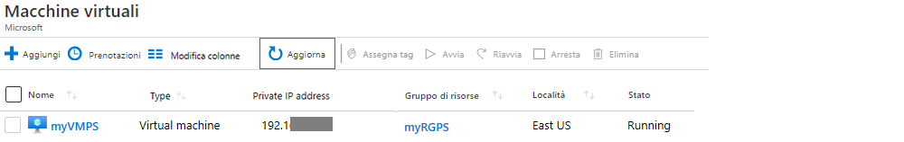
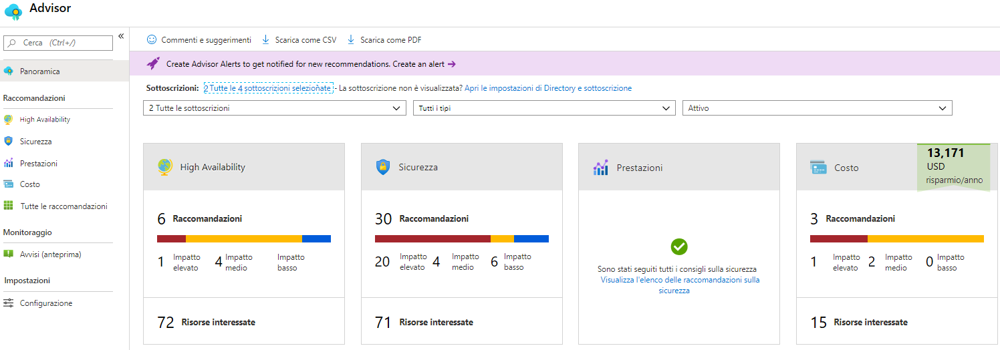
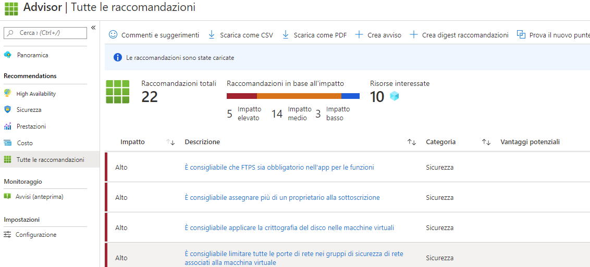

---
wts:
    title: '10. Creare una VM con PowerShell (10 min)'
    module: 'Modulo 03. Descrizione delle soluzioni e degli strumenti di gestione principali'
---
# 10. Creare una VM con PowerShell

In questa procedura dettagliata verrà configurato Cloud Shell, verrà usato il modulo Azure PowerShell per creare un gruppo di risorse e una macchina virtuale, quindi verranno esaminate le raccomandazioni di Azure Advisor. 

# Attività 1. Configurare Cloud Shell (10 min)

In questa attività verrà configurato Cloud Shell. 

1. Accedere al [portale di Azure](https://portal.azure.com).

2. Nel portale di Azure aprire **Azure Cloud Shell** facendo clic sull'icona nell'angolo in alto a destra.

    

3. Se Cloud Shell è già stato usato in precedenza, procedere con l'attività successiva. 

4. Quando viene chiesto di selezionare **Bash** o **PowerShell**, selezionare **PowerShell**.

5. Quando richiesto, fare clic su **Crea risorsa di archiviazione** e attendere l'inizializzazione di Azure Cloud Shell. 

# Attività 2. Creare un gruppo di risorse e una macchina virtuale

In questa attività verranno creati un gruppo di risorse e una macchina virtuale con PowerShell.  

1. Assicurarsi che nel menu a discesa nell'angolo in alto a sinistra del riquadro Cloud Shell sia selezionato **PowerShell**.

2. Nella sessione di PowerShell, all'interno del riquadro Cloud Shell, creare un nuovo gruppo di risorse. 

    ```PowerShell
    New-AzResourceGroup -Name myRGPS -Location EastUS
    ```

3. Verificare il nuovo gruppo di risorse. 

    ```PowerShell
    Get-AzResourceGroup | Format-Table
    ```

4. Creare una macchina virtuale. Quando richiesto, specificare il nome utente (**azureuser**) e la password (**Pa$$w0rd1234**) che verranno configurati come account amministratore locale nelle macchine virtuali. Assicurarsi di includere i caratteri apostrofo (`) alla fine di ogni riga ad eccezione dell'ultima (se si digita l'intero comando in una singola riga, questi caratteri non dovranno essere inseriti).

    ```PowerShell
    New-AzVm `
    -ResourceGroupName "myRGPS" `
    -Name "myVMPS" `
    -Location "East US" `
    -VirtualNetworkName "myVnetPS" `
    -SubnetName "mySubnetPS" `
    -SecurityGroupName "myNSGPS" `
    -PublicIpAddressName "myPublicIpPS"
    ```
** Attendere che la VM venga distribuita prima di chiudere PowerShell

5. Chiudere la sessione di PowerShell e il riquadro Cloud Shell.

6. Nel portale di Azure cercare **Macchine virtuali** e verificare che **myVMPS** sia in esecuzione. Questa operazione può richiedere alcuni minuti.

    

7. Accedere alla nuova macchina virtuale ed esaminare le impostazioni in Panoramica e Rete per verificare che la distribuzione sia riuscita con le informazioni fornite. 

# Attività 3. Eseguire comandi in Cloud Shell

In questa attività si sperimenterà con l'esecuzione dei comandi di PowerShell in Cloud Shell. 

1. Nel portale di Azure aprire **Azure Cloud Shell** facendo clic sull'icona nell'angolo in alto a destra.

2. Assicurarsi che nel menu a discesa nell'angolo in alto a sinistra del riquadro Cloud Shell sia selezionato **PowerShell**.

3. Recuperare le informazioni sulla macchina virtuale, come nome, gruppo di risorse, località e stato. Notare che lo stato è **in esecuzione**.

    ```PowerShell
    Get-AzVM -name myVMPS -status | Format-Table -autosize
    ```

4. Arrestare la macchina virtuale. Quando richiesto, confermare l'azione scegliendo Sì. 

    ```PowerShell
    Stop-AzVM -ResourceGroupName myRGPS -Name myVMPS
    ```

5. Verificare lo stato della macchina virtuale. Lo stato dovrebbe ora essere **deallocato**. È anche possibile verificare lo stato della macchina virtuale nel portale. 

    ```PowerShell
    Get-AzVM -name myVMPS -status | Format-Table -autosize
    ```

# Attività 4. Esaminare le raccomandazioni di Azure Advisor

**Nota:** questa stessa attività viene eseguita nel lab Creare una VM con l'interfaccia della riga di comando di Azure. 

In questa attività verranno esaminate le raccomandazioni di Azure Advisor per la macchina virtuale. 

1. Nel pannello **Tutti i servizi** cercare e selezionare **Advisor**. 

2. Nel pannello **Advisor** selezionare **Panoramica**. Le raccomandazioni sono raggruppate in base a Disponibilità elevata, Sicurezza, Prestazioni e Costo. 

    

3. Selezionare **Tutte le raccomandazioni**, quindi esaminarle tutte, insieme alle azioni suggerite. 

    **Nota:** le raccomandazioni variano in base alle risorse in uso. 

    

4. È possibile scaricare le raccomandazioni in un file CSV o PDF. 

5. È anche possibile creare avvisi. 

6. Se si ha tempo, continuare a sperimentare con Azure PowerShell. 

Congratulazioni! È stato configurato Cloud Shell, è stata creata una macchina virtuale con PowerShell, sono stati provati i comandi di PowerShell e sono state visualizzate le raccomandazioni di Advisor.

**Nota**: per evitare costi aggiuntivi, è possibile rimuovere questo gruppo di risorse. Cercare e selezionare il gruppo di risorse, quindi fare clic su **Elimina gruppo di risorse**. Verificare il nome del gruppo di risorse, quindi fare clic su **Elimina**. Monitorare la pagina **Notifiche** per verificare l'avanzamento dell'eliminazione.
