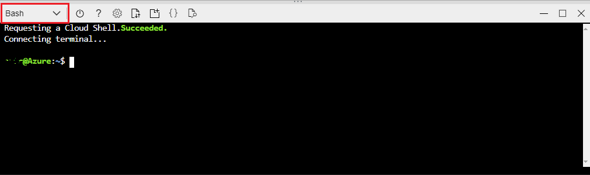
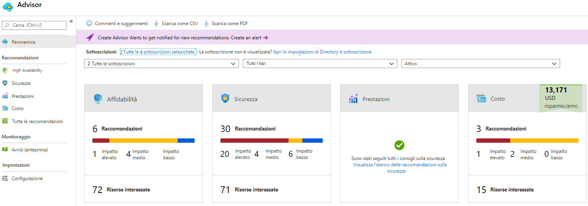

---
wts:
    title: '11 - Creare una macchina virtuale con l’interfaccia della riga di comando (10 min)'
    module: 'Modulo 03: Descrizione delle soluzioni e degli strumenti di gestione principali'
---
# 11. Creare una macchina virtuale con l'interfaccia della riga di comando (10 min)

In questa procedura dettagliata verrà configurato Cloud Shell, verrà usata l'interfaccia della riga di comando di Azure per creare un gruppo di risorse e una macchina virtuale, quindi verranno esaminate le raccomandazioni di Azure Advisor. 

# Attività 1. Configurare Cloud Shell 

In questa attività, verrà configurato Cloud Shell, quindi si userà l'interfaccia della riga di comando di Azure per creare un gruppo di risorse e una macchina virtuale.  

1. Accedere al [portale di Azure](https://portal.azure.com).

2. Nel portale di Azure aprire **Azure Cloud Shell** facendo clic sull'icona nell'angolo in alto a destra.

    
   
3. Nella finestra di dialogo Benvenuti in Azure Cloud Shell, quando viene richiesto di selezionare **Bash** o **PowerShell**, selezionare **Bash**. 

4. Si apre una nuova finestra con il messaggio **Non sono state montate risorse di archiviazione**. Selezionare **impostazioni avanzate**.

5. Nella schermata delle impostazioni avanzate, riempire i seguenti campi, quindi fare clic su Crea risorse di archiviazione:
    - Gruppo di risorse: **Crea nuovo gruppo di risorse**
    - Account di archiviazione: Creare un nuovo account di archiviazione e usare un nome che sia univoco a livello globale (ad esempio: cloudshellstoragemystorage)
    - Condivisione file: Creare un nuovo file con il nome cloudshellfileshare


# Attività 2. Usare l'interfaccia della riga di comando per creare una macchina virtuale

In questa attività verranno creati un gruppo di risorse e una macchina virtuale con l'interfaccia della riga di comando di Azure.

1. Assicurarsi che nel menu a discesa nell'angolo in alto a sinistra del riquadro Cloud Shell sia selezionato **Bash** (in caso contrario, selezionarlo).

    

2. Nella sessione di Bash, all'interno del riquadro Cloud Shell, creare un nuovo gruppo di risorse. 

    ```cli
    az group create --name myRGCLI --location EastUS
    ```

3. Verificare che il gruppo di risorse sia stato creato.

    ```cli
    az group list --output table
    ```

4. In Cloud Shell, immettere i comando sotto riportato e accertarsi che ciascuna riga, eccetto l'ultima, sia seguita da una barra retroversa ('\'). Se si digita l'intero comando sulla stessa riga, non usare questi caratteri. 

    ```cli
    az vm create \
    --name myVMCLI \
    --resource-group myRGCLI \
    --image UbuntuLTS \
    --location EastUS2 \
    --admin-username azureuser \
    --admin-password Pa$$w0rd1234
    ```

    >**Nota**: se si usa la riga di comando in un computer Windows, sostituire il carattere barra rovesciata (`\`) con il carattere accento circonflesso (`^`).

    **Nota**: il completamento del comando richiede da 2 a 3 minuti. Il comando creerà una macchina virtuale e varie risorse associate, ad esempio di archiviazione, rete e sicurezza. Non continuare con il passaggio successivo finché non viene completata la distribuzione della macchina virtuale. 

5. Al termine dell'esecuzione del comando, nella finestra del browser chiudere il riquadro Cloud Shell.

6. Nel portale di Azure cercare **Macchine virtuali** e verificare che **myVMCLI** sia in esecuzione.

    


# Attività 3. Eseguire comandi in Cloud Shell

In questa attività si sperimenterà con l'esecuzione dei comandi dell'interfaccia della riga di comando in Cloud Shell. 

1. Nel portale di Azure aprire **Azure Cloud Shell** facendo clic sull'icona nell'angolo in alto a destra.

2. Assicurarsi che nel menu a discesa nell'angolo in alto a sinistra del riquadro Cloud Shell sia selezionato **Bash**.

3. Recuperare le informazioni sulla macchina virtuale di cui è stato effettuato il provisioning, come nome, gruppo di risorse, località e stato. Notare che lo stato è **in esecuzione**.

    ```cli
    az vm show --resource-group myRGCLI --name myVMCLI --show-details --output table 
    ```

4. Arrestare la macchina virtuale. Notare il messaggio che avvisa che la fatturazione continua finché la macchina virtuale non viene deallocata. 

    ```cli
    az vm stop --resource-group myRGCLI --name myVMCLI
    ```

5. Verificare lo stato della macchina virtuale. Lo stato dovrebbe ora essere **arrestato**.

    ```cli
    az vm show --resource-group myRGCLI --name myVMCLI --show-details --output table 
    ```

# Attività 4. Esaminare le raccomandazioni di Azure Advisor

In questa attività verranno esaminate le raccomandazioni di Azure Advisor.

   **Nota:** se è stato completato il lab precedente (Creare una macchina virtuale con PowerShell), questa attività è già stata eseguita. 

1. Nel pannello **Tutti i servizi** cercare e selezionare **Advisor**. 

2. Nel pannello **Advisor** selezionare **Panoramica**. Le raccomandazioni sono raggruppate in base a Disponibilità elevata, Sicurezza, Prestazioni e Costo. 

    

3. Selezionare **Tutte le raccomandazioni**, quindi esaminarle tutte, insieme alle azioni suggerite. 

    **Nota:** le raccomandazioni variano in base alle risorse in uso. 

    

4. È possibile scaricare le raccomandazioni in un file CSV o PDF. 

5. È anche possibile creare avvisi. 

6. Se si ha tempo, continuare a sperimentare con l'interfaccia della riga di comando di Azure. 

Congratulazioni! È stato configurato Cloud Shell, è stata creata una macchina virtuale con l'interfaccia della riga di comando di Azure, sono stati provati i comandi dell'interfaccia della riga di comando di Azure e sono state visualizzate le raccomandazioni di Advisor.

**Nota**: per evitare costi aggiuntivi, è possibile rimuovere questo gruppo di risorse. Cercare e selezionare il gruppo di risorse, quindi fare clic su **Elimina gruppo di risorse**. Verificare il nome del gruppo di risorse, quindi fare clic su **Elimina**. Monitorare la pagina **Notifiche** per verificare l'avanzamento dell'eliminazione.
