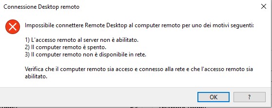

---
wts:
    title: '13 - Proteggere il traffico di rete (10 min)'
    module: 'Modulo 04: Descrizione delle funzionalità di sicurezza generali e di rete'
---
# 13. Proteggere il traffico di rete (10 min)

In questa procedura dettagliata verrà configurato un gruppo di sicurezza di rete.

# Attività 1. Creare una macchina virtuale

In questa attività verrà creata una macchina virtuale Windows Server 2019 Datacenter. 

1. Accedere al [portale di Azure](https://portal.azure.com).

2. Nel pannello **Tutti i servizi** cercare e selezionare **Macchine virtuali**, quindi fare clic su **+ Aggiungi, + Crea, + Nuovo** macchina virtuale.

3. Nella scheda **Informazioni di base** inserire le informazioni seguenti (lasciare i valori predefiniti per tutto il resto):

    | Impostazioni | Valori |
    |  -- | -- |
    | Sottoscrizione | **Usare l'impostazione predefinita fornita** |
    | Gruppo di risorse | **Crea nuovo gruppo di risorse** |
    | Nome della macchina virtuale | **SimpleWinVM** |
    | Area | **(Stati Uniti) Stati Uniti orientali**|
    | Immagine | **Windows Server 2019 Datacenter Gen 1**|
    | Dimensioni | **Standard D2s v3**|
    | Nome utente account amministratore | **azureuser** |
    | Password account amministratore | **Pa$$w0rd1234**|
    | Regole porte in ingresso | **Nessuna**|

4. Passare alla scheda **Rete** e configurare l'impostazione seguente:

    | Impostazioni | Valori |
    | -- | -- |
    | Gruppo di sicurezza di rete della scheda di interfaccia di rete | **Nessuno**|

5. Passare alla scheda **Gestione** e quindi, nella sezione **Monitoraggio**, selezionare l'impostazione seguente:

    | Impostazioni | Valori |
    | -- | -- |
    | Diagnostica di avvio | **Disabilita**|

6. Lasciare i valori predefiniti per le rimanenti impostazioni, quindi fare clic sul pulsante **Rivedi e crea** alla fine della pagina.

7. Una volta superata la convalida, fare clic sul pulsante **Crea**. La distribuzione della macchina virtuale può richiedere all'incirca cinque minuti.

8. Monitorare la distribuzione. La creazione del gruppo di risorse e della macchina virtuale può richiedere alcuni minuti. 

9. Nel pannello della distribuzione o nell'area di notifica fare clic su **Vai alla risorsa**. 

10. Nel pannello della macchina virtuale **SimpleWinVM** fare clic su **Rete**, esaminare la scheda **Regole porte in ingresso** e notare che non è associato alcun gruppo di sicurezza di rete all'interfaccia di rete della macchina virtuale o alla subnet a cui è collegata l'interfaccia di rete.

    **Nota**: identificare il nome dell'interfaccia di rete. Sarà necessario nell'attività successiva.

# Attività 2. Creare un gruppo di sicurezza di rete

In questa attività verrà creato un gruppo di sicurezza di rete che verrà associato all'interfaccia di rete.

1. Nel pannello **Tutti i servizi** cercare e selezionare **Gruppi di sicurezza di rete**, quindi fare clic su **+ Aggiungi, + Crea, + Nuovo**

2. Nella scheda **Informazioni di base** del pannello **Crea gruppo di sicurezza di rete** specificare le impostazioni seguenti.

    | Impostazione | Valore |
    | -- | -- |
    | Sottoscrizione | **Usare la sottoscrizione predefinita** |
    | Gruppo di risorse | **Selezionare l'impostazione predefinita dall'elenco a discesa** |
    | Nome | **myNSGSecure** |
    | Area | **(Stati Uniti) Stati Uniti orientali**  |

3. Fare clic su **Rivedi e crea** e, dopo la convalida, su **Crea**.

4. Una volta creato il gruppo di sicurezza di rete, fare clic su **Vai alla risorsa**.

5. In **Impostazioni** fare clic su **Interfacce di rete** e quindi su **+ Associa**.

6. Selezionare l'interfaccia di rete identificata nell'attività precedente. 

# Attività 3. Configurare una regola di sicurezza delle porte in ingresso per consentire il traffico RDP

In questa attività verrà consentito il traffico RDP verso la macchina virtuale configurando una regola di sicurezza delle porte in ingresso. 

1. Nel portale di Azure passare al pannello della macchina virtuale **SimpleWinVM**. 

2. Nel riquadro **Panoramica** fare clic su **Connetti**.

3. Tentare di connettersi alla macchina virtuale selezionando RDP e scaricando ed eseguendo il file RDP. Per impostazione predefinita, il gruppo di sicurezza di rete non consente la connessione RDP. Chiudere la finestra del messaggio di errore. 

    

4. Nel pannello della macchina virtuale scorrere in basso fino alla sezione **Impostazioni**, fare clic su **Rete** e notare che le regole di ingresso per il gruppo di sicurezza di rete **myNSGSecure (con collegamento all'interfaccia di rete: myVMNic)** negano tutto il traffico in ingresso ad eccezione di quello all'interno della rete virtuale e dei probe del servizio di bilanciamento del carico.

5. Nella scheda **Regole porta in ingresso** fare clic su **Aggiungi regola porta in ingresso**. Al termine, fare clic su **Aggiungi**. 

    | Impostazione | Valore |
    | -- | -- |
    | Origine | **Qualsiasi**|
    | Intervalli di porte di origine | **\*** |
    | Destinazione | **Qualsiasi** |
    | Intervalli di porte di destinazione | **3389** |
    | Protocollo | **TCP** |
    | Azione | **Consenti** |
    | Priorità | **300** |
    | Nome | **AllowRDP** |

6. Selezionare **Aggiungi**, attendere che venga eseguito il provisioning della regola, quindi ritentare la connessione RDP alla macchina virtuale ritornando all'opzione **Connetti**. Questa volta la connessione dovrebbe riuscire. Ricordare che l'utente è **azureuser** e la password è **Pa$$w0rd1234**.

# Attività 4. Configurare una regola di sicurezza delle porte in uscita per negare l'accesso Internet

In questa attività verrà creata una regola delle porte in uscita del gruppo di sicurezza di rete che negherà l'accesso Internet e quindi verrà testato il funzionamento della regola.

1. Continuare nella sessione RDP della macchina virtuale. 

2. Dopo l'avvio della macchina virtuale, aprire il browser **Internet Explorer**. 

3. Verificare che sia possibile accedere all'indirizzo **https://www.bing.com** e quindi chiudere Internet Explorer. Sarà necessario gestire i popup di sicurezza avanzata di Internet Explorer. 

    **Nota**: verrà ora configurata una regola per negare l'accesso Internet in uscita. 

4. Nel portale di Azure, tornare nel pannello della macchina virtuale **SimpleWinVM**. 

5. In **Impostazioni** fare clic su **Rete** e quindi su **Regole porta in uscita**.

6. È presente la regola **AllowInternetOutbound**. Si tratta di una regola predefinita che non può essere rimossa. 

7. Fare clic su **Aggiungi regola porta in uscita** a destra del gruppo di sicurezza di rete **myNSGSecure (con collegamento all'interfaccia di rete: myVMNic)** e configurare una nuova regola di sicurezza in uscita con una priorità più alta che negherà il traffico Internet. Al termine, fare clic su **Aggiungi**. 

    | Impostazione | Valore |
    | -- | -- |
    | Origine | **Qualsiasi**|
    | Intervalli di porte di origine | **\*** |
    | Destinazione | **Tag del servizio** |
    | Tag del servizio di destinazione | **Internet** |
    | Intervalli di porte di destinazione | **\*** |
    | Protocollo | **TCP** |
    | Azione | **Nega** |
    | Priorità | **4000** |
    | Nome | **DenyInternet** |

8. Fare clic su **Aggiungi** Ritornare alla macchina virtuale connessa tramite RDP. 

9. Passare a **https://www.microsoft.com**. La pagina non dovrebbe essere visualizzata. Può essere necessario gestire ulteriori popup di sicurezza avanzata di Internet Explorer.  

**Nota**: per evitare costi aggiuntivi, opzionalmente è possibile rimuovere questo gruppo di risorse. Cercare e selezionare il gruppo di risorse, quindi fare clic su **Elimina gruppo di risorse**. Verificare il nome del gruppo di risorse, quindi fare clic su **Elimina**. Monitorare la pagina **Notifiche** per verificare l'avanzamento dell'eliminazione.
