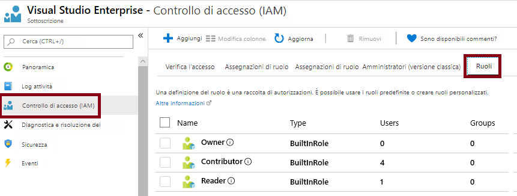
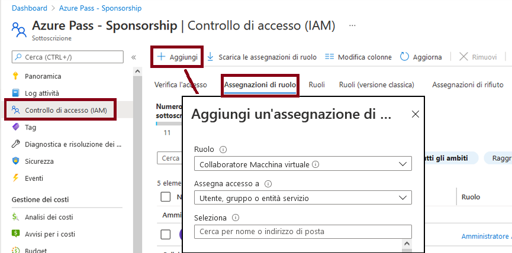
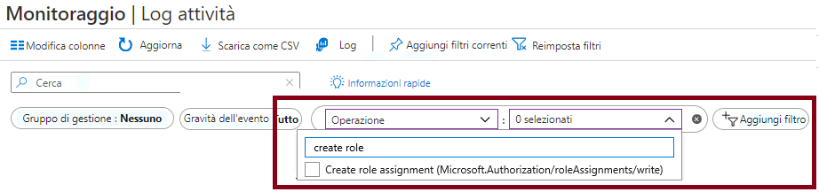

---
wts:
    title: '14. Gestire l'accesso con il controllo degli accessi in base al ruolo (5 min)'
    module: 'Modulo 05. Descrizione delle funzionalità di identità, governance, privacy e conformità'
---
# 14. Gestire l'accesso con il controllo degli accessi in base al ruolo

In questa procedura dettagliata verranno assegnati ruoli e verranno visualizzati i log attività. 

# Attività 1. Visualizzare e assegnare ruoli (5 min)

In questa attività verrà assegnato il ruolo Collaboratore Macchina virtuale. 

1. Accedere al [portale di Azure](https://portal.azure.com).

2. Nel pannello **Tutti i servizi** cercare e selezionare **Gruppi di risorse**, quindi fare clic su **+ Aggiungi, + Crea oppure + Nuovo**.

3. Creare un nuovo gruppo di risorse. Al termine, fare clic su **Crea**. 

    | Impostazione | Valore |
    | -- | -- |
    | Sottoscrizione | **Scegliere le propria sottoscrizione** |
    | Gruppo di risorse | **myRGRBAC** |
    | Area | **(Stati Uniti) Stati Uniti orientali** |
    | | |

4. Fare clic su **Rivedi e crea** e quindi su **Crea**.

5. Scegliere **Aggiorna** per aggiornare la pagina del gruppo di risorse, quindi fare clic sulla voce che rappresenta il nuovo gruppo di risorse creato.

6. Fare clic sul pannello **Controllo di accesso (IAM)** e quindi passare alla scheda **Ruoli**. Scorrere il numero elevato di definizioni di ruolo disponibili. Usare le icone di informazioni per avere un'idea delle autorizzazioni di ogni ruolo. Sono anche disponibili informazioni sul numero di utenti e gruppi assegnati a ogni ruolo.

    

7. Passare alla scheda **Assegnazioni di ruolo** del pannello **myRGRBAC - Controllo di accesso (IAM)**, fare clic su **+ Aggiungi** e quindi fare clic su **Aggiungi assegnazione di ruolo**. Assegnare il ruolo Collaboratore Macchina virtuale al proprio account utente, quindi fare clic su **Salva**. 

    | Impostazione | Valore |
    | -- | -- |
    | Ruolo | **Collaboratore Macchina virtuale** |
    | Assegnare l'accesso a | **utente, gruppo o entità servizio** |
    | Selezionare | il proprio account utente |
    | | |

    **Nota:** il ruolo Collaboratore Macchina virtuale consente di gestire le macchine virtuali, ma non di accedere al relativo sistema operativo né di gestire la rete virtuale e l'account di archiviazione a cui sono connesse.

    

8. Scegliere **Aggiorna** per aggiornare la pagina Assegnazioni di ruolo e verificare che il proprio account utente sia ora indicato come Collaboratore Macchina virtuale. 

    **Nota**: questa assegnazione non concede in realtà privilegi aggiuntivi, perché il proprio account ha già il ruolo Proprietario, che include tutti i privilegi associati al ruolo Collaboratore.

# Attività 2. Monitorare le assegnazioni di ruolo e rimuovere un ruolo

In questa attività verrà visualizzato il log attività per verificare l'assegnazione del ruolo, quindi verrà rimosso il ruolo. 

1. Nel pannello del gruppo di risorse myRGRBAC fare clic su **Log attività**.

2. Fare clic su **Aggiungi filtro**, selezionare **Operazione** e quindi **Crea assegnazione ruolo**.

    

3. Verificare che il log attività visualizzi l'assegnazione di ruolo. 

    **Nota**: si riesce a capire come rimuovere l'assegnazione di ruolo?

Congratulazioni! Sono stati assegnati ruoli e sono stati visualizzati i log attività. 

**Nota**: per evitare costi aggiuntivi, è possibile rimuovere questo gruppo di risorse. Cercare e selezionare il gruppo di risorse, quindi fare clic su **Elimina gruppo di risorse**. Verificare il nome del gruppo di risorse, quindi fare clic su **Elimina**. Monitorare la pagina **Notifiche** per verificare l'avanzamento dell'eliminazione.

