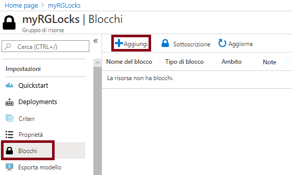
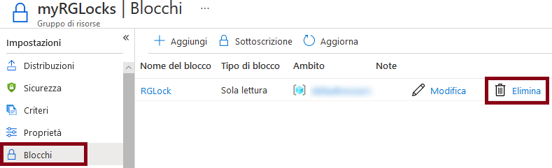

---
wts:
    title: '15 - Gestire i blocchi delle risorse (5 min)'
    module: 'Modulo 05: Descrizione delle funzionalità di identità, governance, privacy e conformità'
---
# 15. Gestire i blocchi delle risorse (5 min)

In questa procedura dettagliata verrà aggiunto un blocco al gruppo di risorse e ne verrà verificata l'eliminazione. In una sottoscrizione è possibile applicare blocchi a gruppi di risorse o a singole risorse per evitare l'eliminazione o la modifica accidentale di risorse critiche.  

# Attività 1. Creare un gruppo di risorse 

In questa attività verrà creato un gruppo di risorse per questo esercizio. 

1. Accedere al [portale di Azure](https://portal.azure.com).

2. Nel pannello **Tutti i servizi** cercare e selezionare **Gruppi di risorse**, quindi fare clic su **+ Aggiungi**, **+ Crea** o **+ Nuovo**.

3. Creare un nuovo gruppo di risorse. Al termine, fare clic su **Crea**. 

    | Impostazione | Valore |
    | -- | -- |
    | Sottoscrizione | **Scegliere le propria sottoscrizione** |
    | Gruppo di risorse | **myRGLocks** |
    | Area | **(Stati Uniti) Stati Uniti orientali** |
    | | |

4. Fare clic su **Rivedi e crea** e quindi su **Crea**.

5. Scegliere **Aggiorna** per aggiornare la pagina del gruppo di risorse, quindi fare clic sulla voce che rappresenta il nuovo gruppo di risorse creato.
    

# Attività 2.  Aggiungere un blocco al gruppo di risorse per verificarne l'eliminazione

In questa procedura dettagliata verrà aggiunto un blocco al gruppo di risorse e ne verrà verificata l'eliminazione. 

1. Nel portale di Azure passare al nuovo gruppo di risorse **myRGLocks** creato.

2. È possibile applicare un blocco a una sottoscrizione, a un gruppo di risorse o a una singola risorsa per evitare l'eliminazione o la modifica accidentale di risorse critiche. 

3. Nella sezione **Impostazioni** fare clic su **Blocchi** e quindi su **+ Aggiungi**. 

    

4. Configurare il nuovo blocco. Al termine, fare clic su **OK**. 

    | Impostazione | Valore |
    | -- | -- |
    | Nome del blocco | '''RGLock''' |
    | Tipo di blocco | **Eliminazione** |
    | | |

5. Fare clic su **Panoramica** e quindi su **Elimina gruppo di risorse**. Digitare il nome del gruppo di risorse e fare clic su **OK**. Viene visualizzato un messaggio di errore indicante che il gruppo di risorse è bloccato e non può essere eliminato.

    

# Attività 3. Verificare l'eliminazione di un membro del gruppo di risorse

In questa attività si verificherà se il blocco della risorsa protegge un account di archiviazione nel gruppo di risorse. 

1. Nel pannello **Tutti i servizi** cercare e selezionare **Account di archiviazione**, quindi fare clic su **+ Aggiungi, + Crea oppure + Nuovo**. 

2. Nel pannello **+Aggiungi +Nuovo oppure +Crea** della pagina **Account di archiviazione** inserire le informazioni seguenti (sostituire **xxxx** nel nome dell'account di archiviazione con lettere e numeri in modo che il nome sia univoco a livello globale). Lasciare i valori predefiniti per tutto il resto.

    | Impostazione | Valore | 
    | --- | --- |
    | Sottoscrizione | **Selezionare la propria sottoscrizione** |
    | Gruppo di risorse | **myRGLocks** |
    | Nome account di archiviazione | **storageaccountxxxx** |
    | Località | **(Stati Uniti) Stati Uniti orientali**  |
    | Prestazioni | **Standard** |
    | Tipologia account | **Archiviazione 2 (utilizzo generico v2)** |
    | Replica | **Archiviazione con ridondanza locale** |
    | Livello di accesso (predefinito) | **Accesso frequente** |
   

3. Fare clic su **Rivedi e crea** per rivedere le impostazioni dell'account di archiviazione e consentire ad Azure di convalidare la configurazione. 

4. Dopo la convalida, fare clic su **Crea**. Attendere la notifica della creazione corretta dell'account. 

5.  Attendere la notifica della creazione corretta dell'account di archiviazione. 

6. Accedere al nuovo account di archiviazione, quindi nel riquadro **Panoramica** fare clic su **Elimina**. Verrà visualizzato un messaggio di errore indicante che la risorsa o la risorsa padre ha un blocco di eliminazione. 

    

    **Nota**: anche se non è stato creato specificamente per l'account di archiviazione, il blocco è stato creato a livello del gruppo di risorse che contiene l'account di archiviazione. Di conseguenza, questo blocco a livello *padre* impedisce l'eliminazione della risorsa e l'account di archiviazione eredita il blocco dalla risorsa padre.

# Attività 4. Rimuovere il blocco della risorsa

In questa attività verrà rimosso il blocco della risorsa e verrà verificata la rimozione. 

1. Tornare nel pannello del gruppo di risorse **myRGLocks-XXXXXXXX** e fare clic su **Blocchi** nella sezione **Impostazioni**.
    
2. Fare clic sul collegamento **Elimina** all'estrema destra della voce **myRGLocks-XXXXXXXX**, a destra di **Modifica**.

    

3. Tornare nel pannello dell'account di archiviazione e verificare che è ora possibile eliminare la risorsa.

Congratulazioni! È stato creato un gruppo di risorse a cui è stato aggiunto un blocco, quindi è stata verificata l'eliminazione di una risorsa del gruppo di risorse e infine il blocco è stato rimosso. 

**Nota**: per evitare costi aggiuntivi, è possibile rimuovere questo gruppo di risorse. Cercare e selezionare il gruppo di risorse, quindi fare clic su **Elimina gruppo di risorse**. Verificare il nome del gruppo di risorse, quindi fare clic su **Elimina**. Monitorare la pagina **Notifiche** per verificare l'avanzamento dell'eliminazione.
