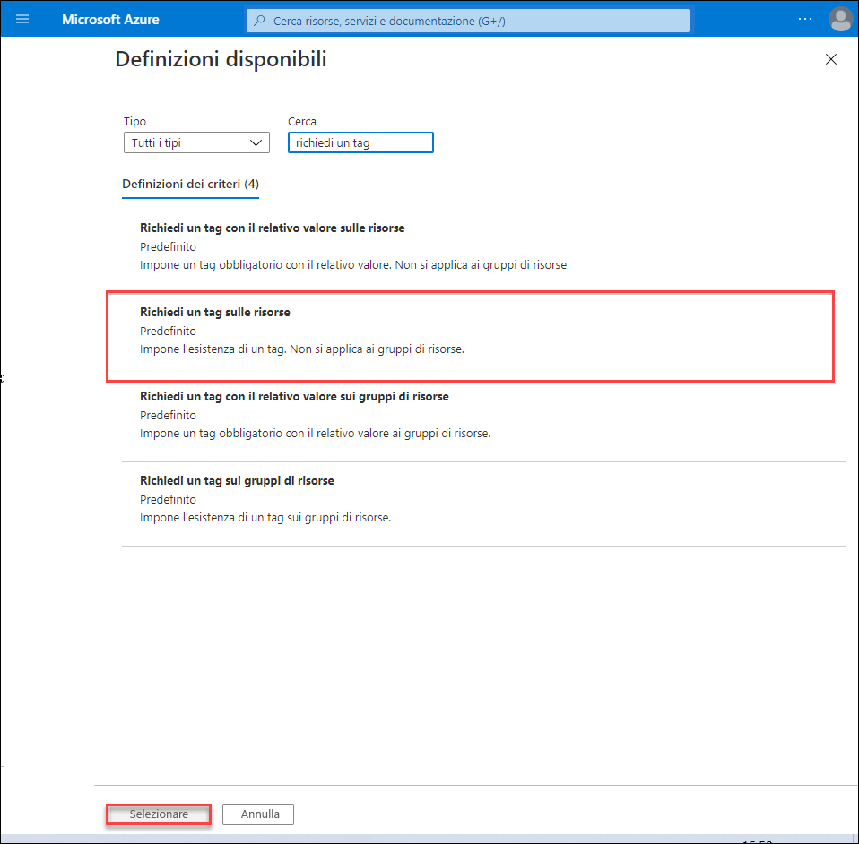
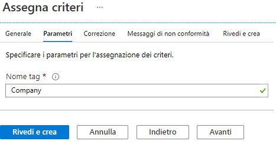
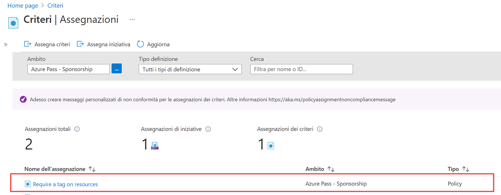
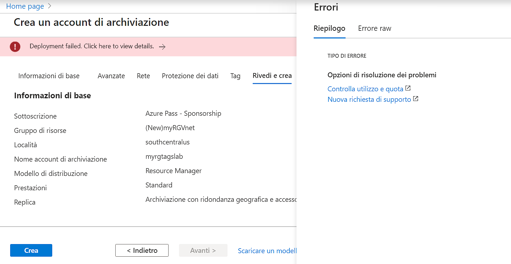
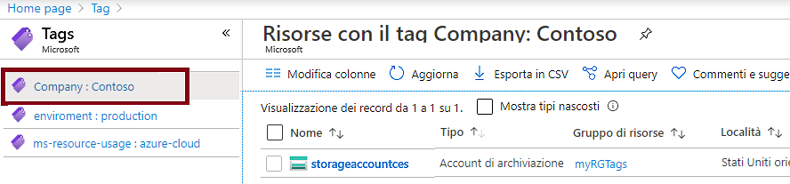
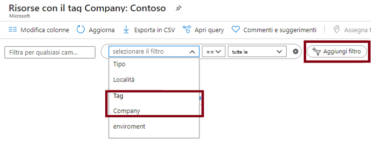

---
wts:
    title: '16 - Implementare l’assegnazione di tag alle risorse (5 min)'
    module: 'Modulo 05: Descrizione delle funzionalità di identità, governance, privacy e conformità'
---
# 16. Implementare l'assegnazione di tag alle risorse (5 min)

In questa procedura dettagliata verrà creato un criterio che richiede l'assegnazione di tag, verrà creato un account di archiviazione e verrà verificata l'assegnazione di tag, quindi verranno visualizzate le risorse con un tag specificato e infine verrà rimosso il criterio di assegnazione di tag.

# Attività 1. Creare un'assegnazione di criteri 

In questa attività verrà configurato il criterio **Richiedi un tag sulle risorse**, che verrà assegnato alla sottoscrizione. 

1. Accedere al [portale di Azure](https://portal.azure.com).

2. Nel pannello **Tutti i servizi** cercare e selezionare **Criteri**.

3. Scorrere in basso fino alla sezione **Creazione**, fare clic su **Assegnazioni** e quindi su **Assegna criteri** nella parte superiore della pagina.

4. L'impostazione di **Ambito** indica che il criterio verrà applicato all'intera sottoscrizione. 

5. In **Informazioni di base** selezionare il pulsante con i puntini di sospensione di **Definizione criteri** sul lato destro della casella di testo. Nella casella **Cerca** immettere il valore **tag**. Verrà visualizzato un elenco di criteri correlati con la parola **tag**. Scorrere in basso fino a trovare la definizione **Richiedi un tag sulle risorse**, selezionarla, quindi fare clic su **Seleziona**.

   
   
6. Nella scheda **Parametri** digitare **Company** come nome per il tag. Immettere **Contoso** come valore. Fare clic su **Rivedi e crea** e quindi su **Crea**.

    

7. L'assegnazione del criterio **Richiedi un tag sulle risorse** è ora effettiva. Quando viene creata una risorsa, è necessario che includa un tag con la chiave Company.
   **Nota: l'applicazione del criterio potrebbe richiedere fino a 30 minuti.** 

   

# Attività 2. Creare un account di archiviazione per verificare l'obbligo di assegnazione di tag

In questa attività verrà creato un account di archiviazione per verificare l'obbligo di assegnazione di tag. 

1. Nel pannello **Tutti i servizi** del portale di Azure cercare e selezionare **Account di archiviazione**, quindi fare clic su **+ Aggiungi + Nuovo + Crea**.

2. Nella scheda **Informazioni di base** del pannello **Crea account di archiviazione** inserire le informazioni seguenti (sostituire **xxxx** nel nome dell'account di archiviazione con lettere e numeri in modo che il nome sia univoco a livello globale). Lasciare i valori predefiniti per tutto il resto.

    | Impostazione | Valore | 
    | --- | --- |
    | Sottoscrizione | **Usare l'impostazione predefinita fornita** |
    | Gruppo di risorse | **Crea nuovo gruppo di risorse** |
    | Nome account di archiviazione | **storageaccountxxxx** |
    | Località | **(Stati Uniti) Stati Uniti orientali** |

3. Fare clic su **Rivedi e crea**. 

    **Nota:** il test si propone di verificare cosa succede se non viene specificato il tag. Notare che l'applicazione dei criteri potrebbe richiedere fino a 30 minuti.

4. Verrà visualizzato un messaggio di convalida non riuscita. Fare clic sul messaggio **Fare clic qui per visualizzare i dettagli**. Nella scheda **Riepilogo** del pannello **Errori** viene visualizzato un messaggio di errore che indica che la risorsa non è consentita dai criteri.

    **Nota:** se si apre la scheda Errore raw verrà visualizzato il nome del tag specifico richiesto. 

    

5. Chiudere il riquadro **Errore** e fare clic su **Indietro** nella parte inferiore dello schermo. Specificare le informazioni per l'assegnazione di tag. 

    | Impostazione | Valore | 
    | --- | --- |
    | Nome tag | **Company** (potrebbe non essere incluso nell'elenco a discesa) |

6. Fare clic su **Rivedi e crea** e verificare se la convalida è riuscita. Fare clic su **Crea** per distribuire l'account di archiviazione. 

# Attività 3. Visualizzare tutte le risorse con uno specifico tag

1. Nel pannello **Tutti i servizi** del portale di Azure cercare e selezionare **Tag**.

2. Notare tutti i tag e i relativi valori. Fare clic sulla coppia chiave-valore **Company : Contoso**. Verrà visualizzato un pannello che mostra il nuovo account di archiviazione creato, purché durante la distribuzione sia stato incluso il tag. 

   

3. Nel portale aprire il pannello **Tutte le risorse**.

4. Fare clic su **Aggiungi filtro** e aggiungere la chiave del tag **Company** come categoria di filtro. Con il filtro applicato, verrà visualizzato solo l'account di archiviazione.

    

# Attività 4. Eliminare l'assegnazione del criterio

In questa attività verrà rimosso il criterio **Richiedi un tag sulle risorse** in modo che non influisca sulle operazioni future. 

1. Nel pannello **Tutti i servizi** del portale cercare e selezionare **Criteri**.

2. Fare clic sul criterio **Richiedi un tag sulle risorse**.

3. Fare clic su **Elimina assegnazione** nel menu superiore.

4. Confermare che si desidera eliminare l'assegnazione del criterio facendo clic su **Sì** nella finestra di dialogo **Elimina assegnazione**

5. Se si ha tempo, creare un'altra risorsa senza un tag per verificare che il criterio non ha più effetto.

Congratulazioni! In questa procedura dettagliata è stato creato un criterio per l'assegnazione di tag, è stata creata una risorsa (account di archiviazione) ed è stato verificato il criterio per l'assegnazione di tag, quindi sono state visualizzate le risorse con un tag specifico e infine è stato rimosso il criterio per l'assegnazione di tag.

**Nota**: per evitare costi aggiuntivi, opzionalmente è possibile rimuovere questo gruppo di risorse. Cercare e selezionare il gruppo di risorse, quindi fare clic su **Elimina gruppo di risorse**. Verificare il nome del gruppo di risorse, quindi fare clic su **Elimina**. Monitorare la pagina **Notifiche** per verificare l'avanzamento dell'eliminazione.
