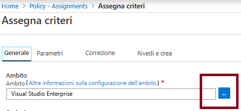
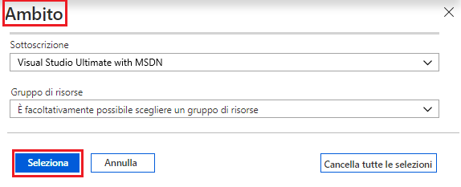
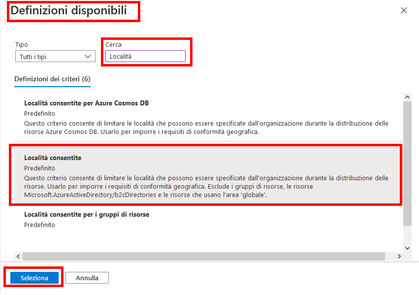
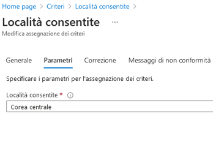
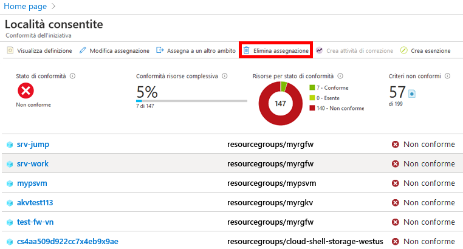

---
wts:
    title: '17 - Creare un’istanza di Criteri di Azure (10 min)'
    module: 'Modulo 05: Descrizione delle funzionalità di identità, governance, privacy e conformità'
---
# 17 - Creare un'istanza di Criteri di Azure

In questa procedura dettagliata verrà creata un'istanza di Criteri di Azure per limitare la distribuzione delle risorse di Azure a una località specifica.

# Attività 1. Creare un'assegnazione di criteri (10 min)

In questa attività verrà creato il criterio per le località consentite, che verrà assegnato alla sottoscrizione. 

1. Accedere al [portale di Azure](https://portal.azure.com).

2. Nel pannello **Tutti i servizi** cercare e selezionare **Criteri**, quindi nella sezione **Creazione** fare clic su **Definizioni**.  Esaminare l'elenco di definizioni di criteri predefinite. Ad esempio, nell'elenco a discesa **Categoria** selezionare solo **Calcolo**. La definizione **SKU di macchine virtuali consentiti** consente di specificare un set di SKU di macchine virtuali che l'organizzazione può distribuire.

3. Tornare nella pagina **Criteri**, quindi nella sezione **Creazione** fare clic su **Assegnazioni**. Un'assegnazione è un criterio assegnato per l'implementazione in uno specifico ambito. Ad esempio, una definizione può essere assegnata all'ambito della sottoscrizione. 

4. Fare clic su **Assegna criterio** nella parte superiore della pagina **Criteri - Assegnazioni**.

5. Nella pagina **Assegna criterio** fare clic sui puntini di sospensione per scegliere il selettore di ambito.

    

6. Assicurarsi che sia selezionata la propria sottoscrizione. Il nome della sottoscrizione potrebbe essere diverso. È possibile facoltativamente scegliere un gruppo di risorse come ambito del criterio. Lasciare le impostazioni predefinite e fare clic su **Seleziona**. 

    **Nota**: l'ambito determina le risorse o i gruppi di risorse a cui si applica l'assegnazione dei criteri. In questo caso, sarebbe possibile assegnare questo criterio a un gruppo di risorse specifico, ma è stato scelto il livello di sottoscrizione. Tenere presente che è possibile escludere risorse in base alla configurazione dell'ambito. Le esclusioni sono facoltative.

    

7. Selezionare il pulsante con i puntini di sospensione di **Definizione criteri**. Nella casella **Cerca** digitare **località**, fare clic sulla definizione **Località consentite** e quindi su **Seleziona**.

    **Nota**: la definizione del criterio **Località consentite** consente di specificare una località in cui devono essere distribuite tutte le risorse. Se si sceglie una località diversa, la distribuzione non sarà consentita. Per altre informazioni, vedere la pagina [Esempi di Criteri di Azure](https://docs.microsoft.com/it-it/azure/governance/policy/samples/index).

   

8.  Nel riquadro **Assegna criterio** passare alla scheda **Parametri**, fare clic sulla freccia all'estremità della casella **Località consentite**, quindi scegliere **Giappone occidentale** nell'elenco visualizzato. Lasciare inalterati tutti gli altri valori e fare clic su **Rivedi e crea**, quindi su **Crea**.

    

9. L'assegnazione del criterio **Località consentite** è riportata nel riquadro **Criteri - Assegnazioni** ed è ora implementata, applicando il criterio al livello di ambito specificato (sottoscrizione).

# Attività 2. Testare il criterio Località consentite

In questa attività verrà testato il criterio Località consentite. 

1. Nel pannello **Tutti i servizi** del portale di Azure cercare e selezionare **Account di archiviazione**, quindi fare clic su **+ Aggiungi, + Crea oppure + Nuovo**.

2. Configurare l'account di archiviazione (sostituire **xxxx** nel nome dell'account di archiviazione con lettere e numeri in modo che il nome sia univoco a livello globale). Lasciare i valori predefiniti per tutto il resto. 

    | Impostazione | Valore | 
    | --- | --- |
    | Sottoscrizione | **Usare la propria sottoscrizione** |
    | Gruppo di risorse | **myRGPolicy** (Crea nuovo) |
    | Nome account di archiviazione | **storageaccountxxxx** |
    | Località | **(Stati Uniti) Stati Uniti orientali** |
    | | |

3. Fare clic su **Rivedi e crea** e quindi su **Crea**. 

4. Verrà visualizzato un messaggio di errore di distribuzione non riuscita, indicante che questa risorsa non è consentita dai criteri, con il nome del criterio **Località consentite**.

# Attività 3. Eliminare l'assegnazione del criterio

In questa attività verrà rimossa l'assegnazione del criterio Località consentite e ne verrà verificata l'eliminazione. 

L'assegnazione del criterio verrà eliminata per assicurare che le eventuali operazioni future da eseguire non vengano bloccate.

1. Nel pannello **Tutti i servizi** cercare e selezionare **Criteri**, quindi fare clic sul criterio **Località consentite**.

    **Nota**: nel pannello **Criteri** è possibile visualizzare lo stato di conformità dei vari criteri assegnati.

    **Nota**: il criterio Località consentite potrebbe mostrare risorse non conformi. In tal caso, si tratta di risorse create prima dell'assegnazione del criterio.

2. Fare clic su **Elimina assegnazione** nel menu superiore.

   

3. Confermare che si desidera eliminare l'assegnazione del criterio facendo clic su **Sì** nella finestra di dialogo **Elimina assegnazione**

4. Provare a creare un altro account di archiviazione per verificare che il criterio non è più effettivo.

    **Nota**: gli scenari comuni in cui il criterio **Località consentite** può risultare utile sono: 
    - *Verifica dei costi*: si potrebbero avere sottoscrizioni diverse per località diverse. Il criterio assicura che tutte le risorse vengano distribuite nell'area prevista per facilitare la verifica dei costi. 
    - *Conformità ai requisiti di residenza dei dati e sicurezza*: si potrebbero anche avere requisiti di residenza dei dati, nonché creare sottoscrizioni in base a clienti o carichi di lavoro specifici, e definire che tutte le risorse devono essere distribuite in un determinato data center per rispettare i requisiti di conformità di dati e sicurezza.

Congratulazioni! È stata creata un'istanza di Criteri di Azure per limitare la distribuzione delle risorse di Azure in un determinato data center.

**Nota**: per evitare costi aggiuntivi, è possibile rimuovere questo gruppo di risorse. Cercare e selezionare il gruppo di risorse, quindi fare clic su **Elimina gruppo di risorse**. Verificare il nome del gruppo di risorse, quindi fare clic su **Elimina**. Monitorare la pagina **Notifiche** per verificare l'avanzamento dell'eliminazione.
