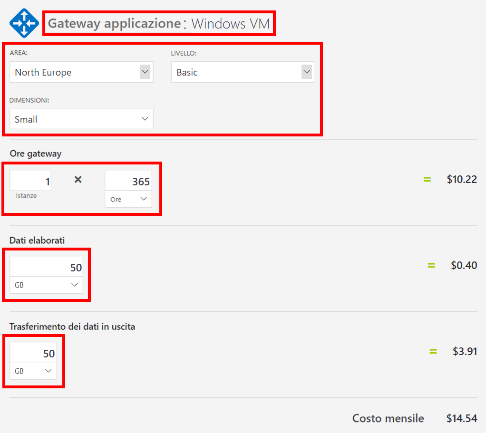
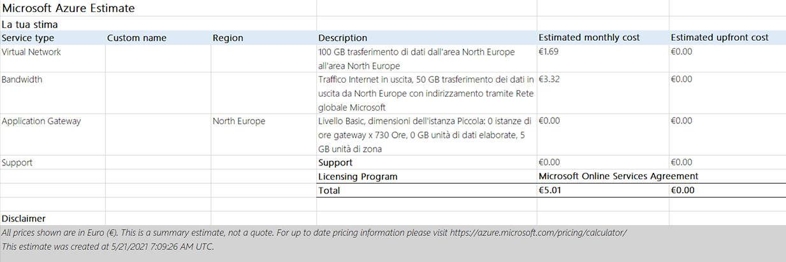

---
wts:
    title: '19 - Usare il Calcolatore dei prezzi di Azure (10 min)'
    module: 'Modulo 06: Descrizione di Gestione costi di Azure e Contratti di servizio'
---
# 19 - Usare il Calcolatore dei prezzi di (10 min)

In questa procedura dettagliata verrà usato il Calcolatore dei prezzi di Azure per generare una stima dei costi relativi a una macchina virtuale di Azure e alle risorse di rete associate.

# Attività 1. Configurare il Calcolatore dei prezzi

In questa attività verrà stimato il costo di un'infrastruttura di esempio usando il Calcolatore dei prezzi di Azure. 

**Nota**: per creare una stima del Calcolatore dei prezzi di Azure, questa procedura dettagliata prevede configurazioni di esempio per la VM e per le risorse correlate. Usare queste configurazioni di esempio oppure in alternativa inserire nel Calcolatore dei prezzi di Azure i dettagli dei requisiti delle risorse *effettive*.

1. In un browser passare alla pagina Web [Calcolatore prezzi](https://azure.microsoft.com/it-it/pricing/calculator/).

2. Per aggiungere i dettagli della configurazione della VM, fare clic su **Macchine virtuali** nella scheda **Prodotti**. Scorrere in basso per visualizzare i dettagli delle macchine virtuali. 

3. Sostituire i testi **La tua stima** e **Macchine virtuali** con nomi più descrittivi per la stima del Calcolatore dei prezzi di Azure e per la configurazione della VM. L'esempio di questa procedura dettagliata usa **My Pricing Calculator Estimate** per la stima e **Windows VM** per la configurazione della VM.

   

4. Modificare la configurazione predefinita della VM.

    | Impostazioni | Valore |
    | -- | -- |
    | Area | **Europa settentrionale** |
    | Sistema operativo | **Windows** |
    | Tipo | **(solo sistema operativo)** |
    | Livello | **Standard** |  
    | Istanza | **A2: 2 core, 3,5 GB di RAM, 135 GB di archiviazione temporanea** |

   

    **Nota**: le specifiche e i prezzi dell'istanza della VM possono essere diversi da quelli indicati in questo esempio. Seguire questa procedura dettagliata scegliendo un'istanza che corrisponda il più possibile all'esempio. Per visualizzare i dettagli su opzioni di prodotti VM diversi, scegliere **Dettagli prodotto** dal menu **Altre informazioni** a destra.

5. Impostare **Opzione di fatturazione** su **In base al consumo**.

   

6. In Azure un mese è definito come 730 ore. Se la VM deve essere disponibile il 100% del tempo ogni mese, impostare il valore di ore al mese su `730`. L'esempio di questa procedura dettagliata richiede che una VM sia disponibile il 50% del tempo ogni mese.

    Lasciare il numero di VM impostato su `1` e cambiare il valore di ore al mese in `365`.

   

7. Nel riquadro **Managed Disks** modificare la configurazione di archiviazione predefinita della VM.

    | Livello | Dimensione disco | Numero di dischi | Snapshot | Transazioni di archiviazione |
    | ---- | --------- | --------------- | -------- | -------------------- |
    | HDD Standard | S30: 1024 GiB | 1 | No | 10.000 |

   

8. Per aggiungere larghezza di banda di rete alla stima, passare all'inizio della pagina Web del Calcolatore dei prezzi di Azure. Fare clic su **Rete** nel menu dei prodotti a sinistra, quindi fare clic sul riquadro **Larghezza di banda**. Nella finestra di messaggio **Larghezza di banda elementi aggiunti** fare clic su **Visualizza**.

   

9. Aggiungere un nome per la configurazione della larghezza di banda della VM. L'esempio di questa procedura dettagliata usa il nome **Bandwidth: Windows VM**. Modificare la configurazione predefinita della larghezza di banda aggiungendo i dettagli seguenti.

    | Area | Zona 1 Trasferimento dei dati in uscita |
    | ------ | -------------------------------------- |
    | Europa settentrionale | 50 GB |

   

10. Per aggiungere un gateway applicazione, tornare all'inizio della pagina Web del Calcolatore dei prezzi di Azure. Nel menu dei prodotti **Rete** fare clic sul riquadro **Gateway applicazione**. Nella finestra di messaggio **Gateway applicazione elementi aggiunti** fare clic su **Visualizza**.

    

11. Aggiungere un nome per la configurazione del gateway applicazione. Questa procedura dettagliata usa il nome **App Gateway: Windows VM**. Modificare la configurazione del gateway applicazione aggiungendo i dettagli seguenti.

    | Impostazioni | Valore |
    | -- | -- |
    | Area | **Europa settentrionale** |
    | Livello | **Basic** |
    | Dimensioni | **Piccola** |
    | Istanze | **1** |  
    | Ore | **365** |
    | Dati elaborati | **50 GB** |
    | Zona 1: America del Nord, Europa | **50 GB**|

    

# Attività 2. Esaminare la stima dei prezzi

In questa attività verranno analizzati i risultati del Calcolatore dei prezzi di Azure. 

1. Scorrere alla fine della pagina Web del Calcolatore dei prezzi di Azure per visualizzare il totale di **Costo mensile stimato**.

    **Nota**: esplorare le varie opzioni disponibili nel Calcolatore dei prezzi di Azure. Ad esempio, questa procedura dettagliata richiede di aggiornare la valuta in Euro.

2. Impostare la valuta su Euro, quindi selezionare **Esporta** per scaricare una copia della stima per la visualizzazione offline in formato Microsoft Excel (`.xlsx`).

    

    

Congratulazioni! È stata scaricata una stima dal Calcolatore dei prezzi di Azure.
